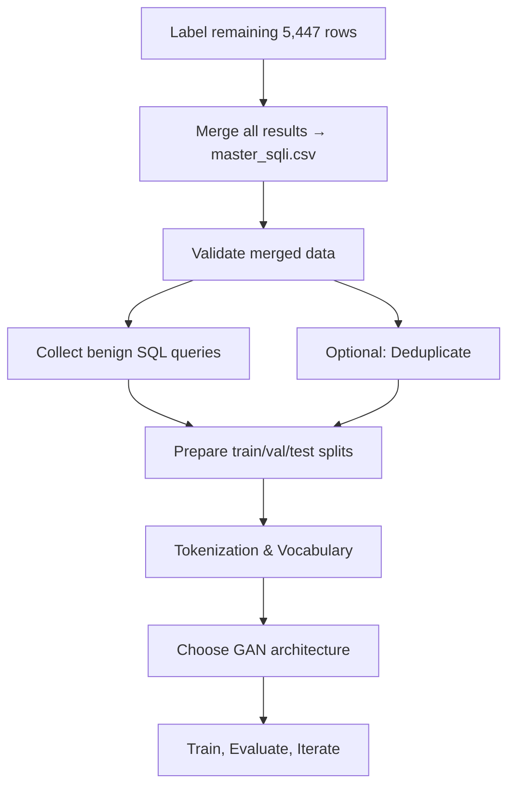

# SQLi-GAN Project: Knowledge Transfer Document

> **Author:** Data Engineering Team  
> **Audience:** AI Specialist (接手 GAN training)  
> **Last Updated:** 2026-05-09  
> **Status:** Data Engineering complete → AI Labeling partially complete → GAN Training **not started**

---

## Table of Contents

1. [Project Overview](#1-project-overview)
2. [Data Sources & Collection](#2-data-sources--collection)
3. [Master Dataset: master_unlabeled.csv](#3-master-dataset-master_unlabeledcsv)
4. [AI Labeling Pipeline (What Was Actually Done)](#4-ai-labeling-pipeline-what-was-actually-done)
5. [Labeling Results: What Exists](#5-labeling-results-what-exists)
6. [Classification Criteria (The 13 SQLi Types)](#6-classification-criteria-the-13-sqli-types)
7. [File Structure Reference](#7-file-structure-reference)
8. [What's Missing / Outstanding Issues](#8-whats-missing--outstanding-issues)
9. [Next Steps for GAN Training](#9-next-steps-for-gan-training)
10. [Appendix: GAN Model Architecture Overview](#10-appendix-gan-model-architecture-overview)
11. [Appendix: Key Metrics for GAN Evaluation](#11-appendix-key-metrics-for-gan-evaluation)
12. [Appendix: Ethical & Legal Notes](#12-appendix-ethical--legal-notes)

---

## 1. Project Overview

### 1.1 Goal
Generate **synthetic SQL Injection (SQLi) payloads** using Generative Adversarial Networks (GANs). The generated payloads should be:
- **Syntactically valid** (parseable as SQL)
- **Diverse** (not collapse to a few templates)
- **Effective** (able to bypass WAF rules)

### 1.2 Three Phases

```
PHASE 1 ──────────────────────────────────────────────┐
  Data Engineering: Collect → Clean → Normalize        │
  Output: master_unlabeled.csv (46,906 rows)           │ ✅ Done
───────────────────────────────────────────────────────┤
PHASE 2 ──────────────────────────────────────────────┤
  AI Labeling: Split → AI classify → Merge             │
  Output: 1,382 result files (41,459 rows labeled)     │ ⚠️ Partial
  Remaining: 5,447 rows not yet labeled                │
───────────────────────────────────────────────────────┤
PHASE 3 ──────────────────────────────────────────────┤
  GAN Training: SeqGAN / Gumbel-Softmax / VAE-GAN      │ ❌ Not started
  Status: Architecture designed, no code written       │
───────────────────────────────────────────────────────┘
```

### 1.3 Important Clarification

This repository contains **two layers of documentation**:

| Layer | Location | Status |
|-------|----------|--------|
| **Blueprint/Plans** | `Asset/Guiding/` — files like `DATA_ENGINE_ANALYSIS.md`, roadmaps, architecture specs | **Describes what was INTENDED, not what was executed** |
| **Actual Work** | `Asset/LabelData/` — the real batch files and AI results | **What was actually done** |

> ⚠️ **Critical**: The file `Asset/Guiding/DATA_ENGINE_ANALYSIS.md` describes a full data pipeline (ML classifier with TF-IDF + RandomForest at 95.2% accuracy, unified_pool of 59,377 rows, etc.). **This pipeline was never executed.** The numbers in that file are targets from the design phase, not actual results.

---

## 2. Data Sources & Collection

### 2.1 Sources

Data was collected from **5 public sources** (see `Asset/Guiding/DATASET_SOURCES.md` for full details):

| # | Source | Format | Samples (approx) | Type |
|---|--------|--------|-----------------|------|
| 1 | Kaggle — sajid576/sql-injection-dataset | CSV | 30k-50k | Binary label (0=clean, 1=SQLi) |
| 2 | GitHub — nidnogg/sqliv5-dataset | CSV + JSON | ~160k (V5 latest) | Pattern + type |
| 3 | GitHub — sqlmapproject/sqlmap (sparse) | XML | 304 structured payloads | **Has attack type labels** (6 types) |
| 4 | GitHub — danielmiessler/SecLists (sparse) | TXT | ~594 | Wordlist by DB engine |
| 5 | GitLab — exploit-database/exploitdb | CSV | 8,696 filtered | **CVE descriptions, NOT payloads** |

### 2.2 Important Data Quality Notes

| Issue | Detail |
|-------|--------|
| **UTF-16 encoding** | Some sqliv5 CSV files use UTF-16-LE (BOM `0xFFFE`). Normal UTF-8 readers will fail. |
| **ExploitDB is metadata** | 8,696 entries from exploitdb are CVE descriptions (e.g., "20/20 Applications Data Shed 1.0 - SQL Injection"), **not actual payloads**. These were filtered out. |
| **sqliv2 has negative samples** | Contains English text passages (literature, philosophy) mixed in as non-SQLi data. These are valuable as "benign" examples for discriminator training. |
| **BCCC payloads are nested** | Payloads from BCCC-SFU dataset have format like `"select * from users WHERE username = \"...payload...\" AND username = \"-3613\""` — extraction needed. |
| **Kaggle requires API key** | The Kaggle source (`sajid576/sql-injection-dataset`) was **never downloaded** because no API key was set up. |

---

## 3. Master Dataset: master_unlabeled.csv

### 3.1 Location
- `C:\Projects\GAN_SQLi\master_unlabeled.csv` (also copied to `Asset\Guiding\`)

### 3.2 Schema (7 columns)

```csv
payload_raw,label,source,sqli_type_hint,is_obfuscated,payload_norm,payload_delex
```

| Column | Description | Example |
|--------|-------------|---------|
| `payload_raw` | Original payload as collected | `""" or pg_sleep ( __TIME__ ) --` |
| `label` | Binary: 1 = SQLi, 0 = benign | `1` |
| `source` | Origin file name | `sqli_dataset.csv` |
| `sqli_type_hint` | Optional hint from source (mostly empty) | `error_fingerprint` |
| `is_obfuscated` | Whether evasion techniques detected | `True` / `False` |
| `payload_norm` | Normalized version (URL-decoded, whitespace-collapsed) | `"" or pg_sleep ( __TIME__ ) --` |
| `payload_delex` | De-lexicalized (values replaced with placeholders) | `"" or pg_sleep ( __TIME__ ) --` |

### 3.3 Statistics

| Metric | Value |
|--------|-------|
| Total rows | **46,906** (indices 0 → 46,905) |
| label=1 (SQLi) | Majority |
| label=0 (benign) | Significant portion (random text, names, emails from sqliv2) |
| Sources | Multiple: `sqli_dataset.csv`, `sqliv2.csv`, `SQLiV3.csv`, `SQLiV5.json`, `BCCC-SFU-SQLInj-2023.csv`, `advanced_sqli.csv`, etc. |

### 3.4 What Was NOT Done to master_unlabeled.csv

The following processing steps were **designed but never executed**:
- ❌ Rule-based classification (pattern matching against 13 SQLi types)
- ❌ Deduplication (exact, normalized, or semantic)
- ❌ ML classifier training (TF-IDF + RandomForest)
- ❌ Merged into a unified labeled dataset

The data was taken **directly** from raw collection into the AI labeling pipeline.

---

## 4. AI Labeling Pipeline (What Was Actually Done)

### 4.1 Overview

Instead of building rule-based classifiers or ML models, the approach taken was to use **large language models (Gemini + Opencode)** to classify each SQLi payload by type.

```
master_unlabeled.csv (46,906 rows)
│
├── batch_0001.csv  (rows 0-29)
├── batch_0002.csv  (rows 30-59)
├── ...
├── batch_1382.csv  (rows 41430-41458)
│
└── 5,447 rows (41459-46905) → NOT YET PROCESSED

Each batch → AI (Gemini or Opencode) → result_batch_XXXX.csv
```

### 4.2 Batch File Format

```csv
row_index,payload_norm,label,sqli_type_hint
0,""" or pg_sleep ( __TIME__ ) --",1,
1,create user name identified by pass123...,1,
```

**Key point**: Batches only contain 4 of the 7 master columns. Only `payload_norm` was sent to the AI (not raw or delex).

### 4.3 AI Prompt Design

From `Asset/Guiding/Guide.md`, the AI was instructed with:

**System Prompt:**
```
You are a cybersecurity expert specializing in SQL injection analysis.
Your task: classify SQL injection payloads accurately.
Always respond with ONLY valid JSON. No text outside JSON.
```

**Per-batch instructions asked the AI to determine:**
1. `sqli_type` — PRIMARY attack technique (13 categories)
2. `db_engine` — target database if detectable (7 categories)
3. `confidence` — float 0.0 to 1.0
4. `reasoning` — ONE short sentence explaining key indicator

### 4.4 AI Response (Result) Format

```csv
row_index,sqli_type,db_engine,confidence,reasoning
0,time_blind,postgresql,0.95,"pg_sleep is PostgreSQL time-based blind SQLi"
```


### 4.6 Checkpoint System

Each worker tracked progress via `progress.json`:
```json
{
  "worker": "Gemini",
  "account": "email@gmail.com",
  "completed_batches": [1, 2, 3, ...],
  "last_completed": 691,
  "rows_completed": 20730,
  "rows_total": 20730,
  "status": "completed"
}
```

### 4.7 Coverage Gap

| Metric | Value |
|--------|-------|
| master_unlabeled.csv rows | **46,906** (index 0-46,905) |
| Rows split into batches | **41,459** (index 0-41,458) |
| Rows WITH results | **41,863** (slightly more than batch rows - some result files may have extra rows) |
| **Rows NOT yet processed** | **5,447** (index 41,459-46,905) |

The unprocessed rows are predominantly from:
- `BCCC-SFU-SQLInj-2023.csv` — complex nested SQLi payloads
- `advanced_sqli.csv` — sophisticated SQLi patterns with type hints

---

## 5. Labeling Results: What Exists

### 5.1 Result Files

**Location:** `Asset/LabelData/results/result_batch_XXXX.csv`

| Count | Format | Schema |
|-------|--------|--------|
| 1,382 files | CSV | `row_index, sqli_type, db_engine, confidence, reasoning` |

### 5.2 Observed Labeling Patterns

**Early batches (index 0-~9000, SQLi payloads):** Detailed classification
```
row_index=0:   time_blind,  postgresql, 0.95, "pg_sleep is PostgreSQL time-based blind SQLi"
row_index=3:   union_based, mysql,      0.95, "UNION SELECT with version() indicates union-based SQLi"
row_index=12:  auth_bypass, generic,    0.95, "admin' or 1=1# is classic auth bypass"
```

**Mid batches (index ~15000, random text, label=0):** Bulk "benign"
```
row_index=14970: benign, generic, 0.9, "not_sql_injection"
row_index=14971: benign, generic, 0.9, "not_sql_injection"
```

**Late batches (index ~41430, SQLi with type hints):** Specific classification
```
row_index=41430: stacked_queries, generic, 0.95, "SELECT users"
row_index=41431: out_of_band,     mysql,   0.95, "LOAD_FILE OOB"
```

### 5.3 What's Missing (No Merge Yet)

```diff
- There is NO master_sqli.csv anywhere in the project.
```

The merge script from `Guide.md` was **never run**. This means:
- Individual result files have NOT been merged back with the original master_unlabeled.csv
- No validation has been performed (checking for label=1 but sqli_type=benign, etc.)
- No statistics on the final labeled distribution exist

---

## 6. Classification Criteria (The 13 SQLi Types)

### 6.1 Complete List

| # | Type | Description | Example Pattern |
|---|------|-------------|-----------------|
| 1 | `union_based` | UNION SELECT to append query | `UNION SELECT 1,version()` |
| 2 | `error_based` | Exploit DB error messages | `EXTRACTVALUE`, `updatexml`, `ctxsys.drithsx` |
| 3 | `boolean_blind` | True/False condition inference | `AND 1=1`, `'xxx'='xxx'` |
| 4 | `time_blind` | Time delay inference | `SLEEP(N)`, `WAITFOR DELAY`, `BENCHMARK` |
| 5 | `heavy_query` | CPU-intensive queries | `COUNT(*) FROM A, B, C` (cross-join) |
| 6 | `stacked_queries` | Multiple statements | `'; DROP TABLE`, `; INSERT` |
| 7 | `out_of_band` | DNS/HTTP exfiltration | `LOAD_FILE`, `xp_cmdshell`, `UTL_HTTP` |
| 8 | `auth_bypass` | Login bypass | `' OR '1'='1`, `admin'--` |
| 9 | `second_order` | Stored SQLi | `INSERT INTO...VALUES...--` |
| 10 | `rce` | Remote command execution | `xp_cmdshell`, `certutil` |
| 11 | `polyglot` | Works across multiple DBs | `SLEEP(1)/\*.*OR.*SLEEP` |
| 12 | `lateral` | Cross-table JOIN injection | `JOIN...ON` |
| 13 | `benign` | Normal SQL, not an attack | Plain SQL queries |

Additional classes:
| 14 | `unknown` | Cannot determine | Genuinely ambiguous |

### 6.2 DB Engine Detection (7 categories)

`mysql` | `mssql` | `oracle` | `postgresql` | `sqlite` | `nosql` | `generic` | `unknown`

### 6.3 What to Watch Out For

- **"benign"** can mean either: (a) plain English text that happens to be in the dataset (negative samples from sqliv2), or (b) legitimate SQL that is not an attack
- **label=0 + sqli_type != "benign"** = potential labeling conflict
- **label=1 + sqli_type="benign"** = error, should be re-examined
- The **reasoning** field is critical for understanding the AI's decision logic

---

## 7. File Structure Reference

```
C:\Projects\GAN_SQLi\
├── master_unlabeled.csv                    ← ROOT source (46,906 rows, 7 cols)
│
├── Asset\
│   ├── Guide\                              ← Onboarding guides (AI fundamentals)
│   │   ├── Onboarding_AI_Knowledge_*.md     ← Neural nets, CNN, Transformer, GANs
│   │   ├── Onboarding_Data_Engineering.md
│   │   └── Data_Engineering_Recap.md
│   │
│   ├── Guiding\                            ← Technical plans & references
│   │   ├── DATA_ENGINE_ANALYSIS.md          ← ⚠️ PLAN: data pipeline (NEVER EXECUTED)
│   │   ├── DATASET_SOURCES.md              ← Data source documentation
│   │   ├── Data_Engine_Direction.md        ← Architecture blueprint v3
│   │   ├── Guide.md                        ← AI labeling workflow instructions
│   │   ├── Type_of_SQLi.md                 ← Complete SQLi taxonomy reference
│   │   ├── SQLi-SeqGAN-Roadmap.md          ← SeqGAN architecture plan
│   │   ├── SQLi-Gumbel-SoftmaxGAN-Roadmap.md ← Gumbel-Softmax plan
│   │   ├── SQLi-VAE-GAN-Roadmap.md         ← VAE-GAN architecture plan
│   │   └── master_unlabeled.csv            ← Copy of root master
│   │
│   └── LabelData\                          ← 🔴 ACTUAL WORK PRODUCT
│       ├── batches\                        ← 1,382 batch files (input to AI)
│       │   ├── batch_0001.csv (rows 0-29)
│       │   ├── batch_0002.csv (rows 30-59)
│       │   └── ...
│       │   └── batch_1382.csv (rows 41430-41458)
│       │
│       ├── results\                        ← 1,382 result files (AI output)
│       │   ├── result_batch_0001.csv
│       │   ├── result_batch_0002.csv
│       │   └── ...
│       │   └── result_batch_1382.csv
│       │
│       └── Knowledge_Transfer_SQLi_GAN.md  ← THIS DOCUMENT
│
└── data_engine\                            ← Data engine source code (if exists)
```

---

## 8. What's Missing / Outstanding Issues

### 8.1 Immediate Gaps

| # | Issue | Impact | Priority |
|---|-------|--------|----------|
| 1 | **5,447 rows UNLABELED** (index 41,459-46,905) | Missing ~12% of dataset | 🔴 High |
| 2 | **No master_sqli.csv** — results never merged | Cannot train without merged dataset | 🔴 High |
| 3 | **Results have 404 extra rows** (41,863 vs 41,459 batch rows) | Needs investigation — possible duplicate/lag | 🟡 Medium |
| 4 | **Kaggle dataset never downloaded** (~30-50k SQLi rows) | Missing valuable source | 🟡 Medium |

### 8.2 Data Quality Issues

| # | Issue | Explanation |
|---|-------|-------------|
| 5 | **No benign SQL dataset** | Only has random text as "benign" (label=0). For GAN discriminator training, you need **real benign SQL queries** (e.g., from application logs, Spider/WikiSQL benchmarks) |
| 6 | **No deduplication** | There are likely duplicate payloads across sources. 46,906 rows may contain many exact/near-duplicates. |
| 7 | **No ML classifier** | Rule-based patterns were designed but never coded. AI labeling was used instead. |
| 8 | **No validation run** | The merge script in Guide.md includes validation (checking label-sqli_type conflicts) — never executed. |

### 8.3 Plans vs Reality Summary

| Item in `DATA_ENGINE_ANALYSIS.md` | Reality |
|-----------------------------------|---------|
| `unified_sqli_pool.csv` (59,377 rows) | ❌ Does not exist |
| ML Classifier (TF-IDF + RF, 95.2%) | ❌ Was never trained |
| `output/datasets/` (13 type-split files) | ❌ Does not exist |
| `output/ml_classifier.pkl` | ❌ Does not exist |
| 3-level dedup (exact + normalized + semantic) | ❌ Never performed |
| Semantic dedup "too slow with 60k samples" | 🤷 Problem never encountered (never processed 60k) |
| 76.3% unknown rate | 🤷 Unknown — was a PLAN target, not actual metric |

---

## 9. Next Steps for GAN Training

### 9.1 Immediate Action Items



### 9.2 Step-by-Step

**Step 1: Label remaining 5,447 rows**
- Continue using the same AI labeling pipeline (Gemini/Opencode)
- Split remaining rows into batches of 30
- Use the same prompt format from `Guide.md`

**Step 2: Merge with merge_script.py**
- The merge script in `Guide.md` (lines 216-265) combines all result_batch files into master_sqli.csv
- Also runs validation (checks for label/sqli_type conflicts)
- **Important**: The script references old paths (`C:\Users\Admin\Documents\GAN\Asset\Data\`). Update paths to `C:\Projects\GAN_SQLi\`

**Step 3: Collect benign SQL**
- For GAN discriminator training, you need real SQL queries that are NOT attacks
- Recommended sources:
  - **Spider/WikiSQL** benchmarks from Yale NLP (real SQL queries)
  - **Chinook/Northwind** sample database query logs
  - **Template generation** with proper SQL grammar (use Faker only for VALUES, not structure)

**Step 4: Build vocabulary**
- Recommended: BPE (Byte-Pair Encoding) trained from scratch on your SQL corpus
- Vocabulary size target: **200-500 tokens**
- Alternative: regex-based SQL-aware tokenizer (see `Data_Engine_Direction.md` for details)

### 9.3 Available Resources

| Resource | Location | What It Contains |
|----------|----------|-----------------|
| AI workflow instructions | `Asset/Guiding/Guide.md` | Prompt templates, merge script, checkpoint system |
| SQLi taxonomy reference | `Asset/Guiding/Type_of_SQLi.md` | Complete classification with examples per DB |
| SeqGAN architecture plan | `Asset/Guiding/SQLi-SeqGAN-Roadmap.md` | Policy gradient approach, LSTM Generator, MC Roll-out |
| Gumbel-Softmax plan | `Asset/Guiding/SQLi-Gumbel-SoftmaxGAN-Roadmap.md` | Transformer Decoder, Temperature Scheduling, Composite Score |
| VAE-GAN architecture plan | `Asset/Guiding/SQLi-VAE-GAN-Roadmap.md` | Latent-hybrid, Gumbel-Softmax, KL annealing |

---

## 10. Appendix: GAN Model Architecture Overview

### 10.1 SeqGAN (Policy Gradient)

| Component | Detail |
|-----------|--------|
| **Generator** | LSTM — produces token sequence autoregressively |
| **Discriminator** | 1D-CNN with multiple filter sizes (captures n-gram features) |
| **Training** | REINFORCE policy gradient + MLE pre-training |
| **Reward** | WAF Oracle (ModSecurity) + SQL Parser Oracle |
| **Key challenge** | Sparse reward (only at end of sequence) → MC Roll-out for intermediate tokens |
| **Key risk** | High variance from MC Roll-out with long sequences |

### 10.2 Gumbel-Softmax GAN

| Component | Detail |
|-----------|--------|
| **Generator** | Transformer Decoder with Gumbel-Softmax output layer |
| **Discriminator** | Dilated CNN (multi-scale kernels: 2-3, 5-8, 12-16 for hierarchical SQL structure) |
| **Training** | Adversarial with temperature scheduling (τ: 1.0 → 0.1) |
| **Unique feature** | Gumbel-Softmax makes discrete sampling differentiable |
| **Key challenge** | Temperature must decay slowly enough to maintain gradient flow |
| **Primary metric** | Composite Score = w1·Validity + w2·(1−Self-BLEU) + w3·(1−Ŵ1) |

### 10.3 VAE-GAN

| Component | Detail |
|-----------|--------|
| **Encoder** | Transformer — compresses SQL to latent space ℝ²⁵⁶ |
| **Generator/Decoder** | Transformer with cross-attention to latent vector |
| **Discriminator** | 1D-CNN with feature matching (layer L−2) |
| **Loss** | Hybrid: ℒ = ℒ_recon + β·ℒ_KL + λ·ℒ_adv + γ·ℒ_fm |
| **Key challenge** | KL collapse (posterior collapse) → requires KL annealing + free bits |
| **Core claim** | Simple baselines (n-gram + mutation) may match VAE-GAN on high-constraint domains |

### 10.4 Common to All Architectures

| Item | Recommendation |
|------|---------------|
| **Tokenizer** | BPE trained from scratch on SQL corpus (vocab 200-500) |
| **De-lexicalization** | Replace table names → `<TABLE>`, numbers → `<NUM>`, strings → `<STR>` |
| **Sequence length (L)** | 95th percentile of corpus length distribution |
| **Special tokens** | `<SOS>`, `<EOS>`, `<PAD>` |
| **WGAN-GP** | Use Wasserstein loss with Gradient Penalty for training stability |
| **D:G update ratio** | 5:1 (update Discriminator 5x per Generator update) |
| **Metrics needed** | WAF Evasion Rate (primary), Syntax Validity, Self-BLEU, Wasserstein Distance |

---

## 11. Appendix: Key Metrics for GAN Evaluation

### 11.1 Primary Metric: WAF Evasion Rate (WER)

```
WER = (payloads that bypass WAF AND are syntactically valid) / total generated
```

- Test against **3 WAF targets**: ModSecurity CRS default, ModSecurity CRS Paranoia Level 3, Cloudflare-equivalent
- Report per attack type (union_based, boolean_blind, etc.)
- Use **bootstrap resampling** (n=10,000) for confidence intervals

### 11.2 Secondary Metrics

| Metric | What It Measures | How |
|--------|-----------------|-----|
| **Syntax Validity Rate** | Are generated payloads parseable? | Parse with `sqlparse`, target ≥85% |
| **Self-BLEU** (N=3) | Diversity — are payloads too repetitive? | Compare n-gram overlap within generated set |
| **Wasserstein Distance** (Ŵ₁) | Does distribution match real data? | Earth Mover's Distance in embedding space |
| **Reward Convergence** | Is training stable? | Track average reward vs. epoch |
| **Latent Space Walk** | Is latent space smooth? (qualitative) | Interpolate latent vectors, observe output |

### 11.3 Required Baselines

Without baselines, metrics are meaningless. Implement at minimum:

1. **Markov Chain / Template-based** — random fill into fixed templates
2. **MLE Transformer** — cross-entropy only (no adversarial loop)
3. **SeqGAN** — policy gradient approach

Compare all methods on the **same frozen test set** with the **same vocabulary**.

---

## 12. Appendix: Ethical & Legal Notes

- All data was collected from **public, legal sources** (GitHub/GitLab public repos, Kaggle public datasets)
- Purpose: **academic research** on SQL injection detection and defense
- **Do not** use generated payloads to attack real systems
- **Do not** deploy the model as an attack tool
- If publishing results, cite all data sources and specify WAF ruleset versions used

---

*End of document. For questions, contact the Data Engineering team.*
