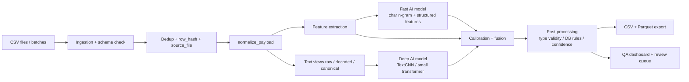
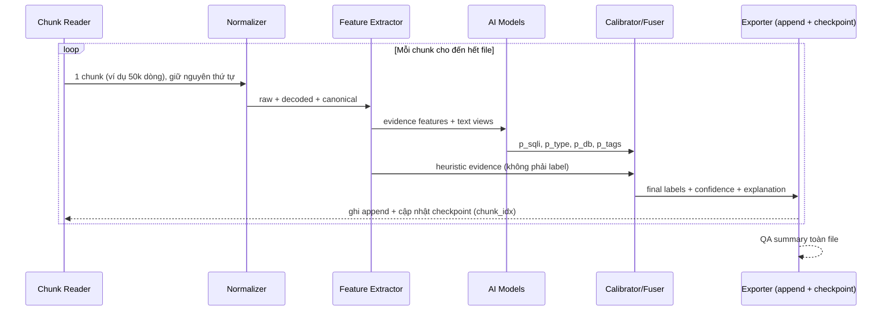

# Thiết kế pipeline gán nhãn AI-only cho SQL injection

## Tóm tắt điều hành

SQL injection vẫn là một lớp tấn công nghiêm trọng: PortSwigger mô tả đây là lỗ hổng cho phép kẻ tấn công can thiệp vào truy vấn mà ứng dụng gửi tới cơ sở dữ liệu, còn OWASP nhấn mạnh đây là lỗi rất phổ biến; trong danh sách CWE Top 25 năm 2025 của MITRE, CWE-89 đứng thứ hai. citeturn10search3turn11view1turn0search2

Với mục tiêu **AI-only labeling**, thiết kế tốt nhất không phải là “nhồi càng nhiều cột nhãn càng tốt vào một bảng”, mà là tách rõ ba lớp: **core labels** dùng cho mô hình và thống kê chuẩn, **auxiliary features** để hỗ trợ reviewer và phân tích lỗi, và **run metadata** để tái lập kết quả. Tôi khuyến nghị giữ nhãn lõi thật gọn, bỏ toàn bộ cột liên quan script, thêm một lớp dấu hiệu định lượng như `has_sleep_kw`, `has_comment_tok`, `has_tautology_pattern`, `entropy`, `obfuscation_score`, và một cột giải thích có cấu trúc ngắn thay vì giải thích tự do dài dòng. Cách này giúp reviewer nhanh hơn nhưng không làm “ô nhiễm” ground truth. Các kỹ thuật SQLi trong thực tế trải rộng từ blind, error, UNION đến stacked queries và out-of-band; hơn nữa, OWASP còn cho thấy né tránh WAF có thể dùng comment chèn giữa keyword, chuẩn hóa bất đối xứng, HPP/HPF, thay thế hàm, và biến thể logic tương đương. Vì vậy, một ontology chỉ có 5 giá trị chính là đủ để làm **primary label**, nhưng cần thêm **secondary tags** để chứa tổ hợp và né tránh. citeturn11view5turn13view0turn11view0

Điểm quan trọng nhất của phản biện là: **AI-only không đồng nghĩa với AI được phép bịa ra độ chắc chắn**. Các subtype như `boolean_blind`, `time_blind`, hay `error_based` trong nhiều trường hợp phụ thuộc vào **response body**, **error disclosure**, hoặc **timing**, tức là phụ thuộc ngữ cảnh thực thi chứ không chỉ chuỗi payload. PortSwigger và sqlmap đều mô tả rõ điều này. Vì thế, với dữ liệu payload thuần văn bản, bạn nên tách **primary coarse label** khỏi **attack tags**, đồng thời phải có `low_confidence` và `review_priority` để đánh dấu những mẫu mà chuỗi đơn lẻ không đủ chứng cứ. citeturn10search9turn10search5turn5search2turn13view0

Về mặt vận hành, kiến trúc khả thi để scale lên toàn bộ file là: **ingestion → normalize_payload() → feature extraction → AI ensemble/multi-task → calibration → post-processing → CSV/Parquet export**. `sqlparse` hữu ích vì là parser **non-validating**, có thể tách/format các câu SQL kể cả khi đầu vào xấu; `SQLGlot` thích hợp cho chuẩn hóa và fingerprint theo dialect vì hỗ trợ parse/transpile nhiều phương ngữ SQL. Về confidence, không nên dùng raw probability; scikit-learn khuyến nghị hiệu chuẩn xác suất và dùng reliability diagrams, Brier/log loss để kiểm tra chất lượng confidence. citeturn11view4turn1search17turn11view2

### Tóm lược bối cảnh trao đổi

| Điểm đã chốt trong trao đổi | Hệ quả thiết kế |
|---|---|
| Bạn muốn **100% AI**, không dùng script label | Loại bỏ `script_sqli_type`, `script_confidence`, `label_agreement`, `needs_ai` khỏi production schema |
| Bạn muốn nhiều dấu hiệu để reviewer đỡ vất vả | Cho phép nhiều **auxiliary features**, nhưng không nâng tất cả lên “ground-truth label” |
| Bạn lo dataset bị phình | Tách **core / aux / metadata** để mô hình chỉ lấy tập cột hẹp |
| Bạn muốn chạy thẳng **toàn bộ file**, không qua pilot mẫu | Cần pipeline versioned, **đọc theo chunk + checkpoint/resume**, export chuẩn hóa, và metadata tái lập; bỏ bước random sample |
| Bạn muốn có output CSV xem được ngay | Tôi đính kèm một **CSV mẫu 100 dòng tổng hợp** ở phần kiến trúc để minh họa schema và output (chỉ minh họa schema, không phải bước chạy mẫu) |

## Đánh giá schema hiện tại

Schema hiện tại của bạn có hướng đi đúng ở bốn điểm: giữ bản payload gốc, có nhãn nhị phân `is_sqli`, có mức confidence, và có các chỉ số obfuscation theo từng kiểu. Vấn đề nằm ở chỗ nhiều cột đang **trộn lẫn ba khái niệm khác nhau**: **nhãn thực thể**, **provenance của nhãn**, và **trạng thái vận hành của pipeline**. Khi chuyển sang AI-only, các cột provenance kiểu script sẽ trở thành “di chỉ hệ thống cũ” và làm rối cả reviewer lẫn mô hình. Ngoài ra, bộ `sqli_type` hiện tại bao phủ các họ lớn, nhưng không phản ánh trọn các kỹ thuật thực chiến như `stacked queries` và `out-of-band` mà sqlmap coi là kỹ thuật hạng nhất; đồng thời một số subtype còn phụ thuộc vào thời gian/response/error nên payload-only labeling cần cẩn trọng hơn. citeturn11view5turn13view0turn10search0turn10search9

| Cột hiện tại | Mục đích | Kiểu dữ liệu nên dùng | Ví dụ | Bắt buộc | Redundancy | Khuyến nghị |
|---|---|---:|---|---|---|---|
| `payload_norm` | Lưu payload quan sát được | `string` | `char(83)char(69)...` | Có | Thấp | **Đổi tên thành `payload_raw`**. Mô tả hiện tại nói “Original” nhưng tên lại là `norm`, rất dễ gây hiểu nhầm |
| `payload_decoded` | Lưu bản sau normalize/decode | `string` | `SELECT ... FROM ...` | Có | Thấp | **Giữ**, nhưng phải gắn `normalizer_version` để tái lập |
| `is_sqli` | Nhãn nhị phân độc hại/không độc hại | `bool` | `1` | Có | Không | **Giữ** |
| `sqli_type` | Họ tấn công chính | `category` | `union_based` | Có nếu `is_sqli=1` | Trung bình với `sqli_types` | **Đổi tên thành `primary_sqli_type`**; giữ ở mức coarse label |
| `sqli_types` | Danh sách nhiều kiểu đồng thời | `string` pipe-sep hoặc `array<string>` | `union_based|boolean_blind` | Nên có | Thấp | **Đổi tên thành `attack_tags`** và mở rộng vocab cho né tránh/tổ hợp |
| `script_sqli_type` | Dự đoán của script | `category` | `union_based` | Không | Cao | **Bỏ** trong AI-only |
| `script_confidence` | Confidence của script | `float` | `0.92` | Không | Cao | **Bỏ** trong AI-only |
| `label_agreement` | So script với AI | `category` | `disagree` | Không | Cao | **Bỏ**; nếu cần thay bằng `self_consistency_flag` |
| `db_engine` | DBMS mục tiêu | `category` | `mysql` | Nên có | Không | **Giữ** |
| `confidence` | Confidence cuối cùng | `float32` | `0.92` | Có | Không | **Giữ**, nhưng phải là confidence đã calibration |
| `tier` | Mức chất lượng / độ tin cậy | `category` | `gold` | Không | Trung bình với `confidence` | **Không dùng `gold/silver/bronze` cho AI-only**; thay bằng `qa_tier` hoặc `confidence_band` |
| `label_source` | Nguồn sinh nhãn | `string/category` | `tier1_exact` | Có | Không | **Giữ**, nhưng đổi semantics thành `ai_v1`, `human_override`, `sandbox_verified`... |
| `is_complex` | Payload có nhiều vector/obfuscation | `bool` | `True` | Nên có | Thấp | **Giữ** |
| `low_confidence` | Cờ triage | `bool` | `False` | Không | Cao với `confidence` | **Có thể materialize**, nhưng xem là cột suy ra |
| `needs_ai` | Có route sang AI hay không | `bool` | `False` | Không | Cao | **Bỏ** vì pipeline đã AI-only |
| `payload_state` | Trạng thái biểu diễn payload | `category` | `normalized` | Không | Trung bình với các cột payload | **Đổi thành `inference_view`** hoặc bỏ nếu đã có `payload_raw/decoded/canonical` riêng |
| `db_confidence` | Confidence của DBMS detection | `float32` | `0.90` | Nên có | Không | **Giữ** |
| `obf_comment` | Mức obfuscation qua comment | `float32` | `0.85` | Nên có | Không | **Giữ** |
| `obf_case` | Mức obfuscation qua case | `float32` | `0.80` | Nên có | Không | **Giữ** |
| `obf_encoding` | Mức obfuscation qua encoding | `float32` | `0.80` | Nên có | Không | **Giữ** |

**So sánh schema hiện tại với schema khuyến nghị**

| Nhóm | Hiện tại | Khuyến nghị |
|---|---|---|
| Payload views | `payload_norm`, `payload_decoded`, `payload_state` | `payload_raw`, `payload_decoded`, `payload_canonical`, tùy chọn `payload_delex`, và `inference_view` nếu thật sự cần |
| Nhãn lõi | `is_sqli`, `sqli_type`, `sqli_types` | `is_sqli`, `primary_sqli_type`, `attack_tags` |
| Provenance | `label_source`, `tier`, `script_*`, `label_agreement` | `label_source`, `model_version`, `normalizer_version`, `run_id`; bỏ toàn bộ `script_*` |
| Confidence & triage | `confidence`, `low_confidence`, `needs_ai` | `confidence`, `confidence_band`, `review_priority`, `low_confidence`; bỏ `needs_ai` |
| DB & obfuscation | `db_engine`, `db_confidence`, `obf_*`, `is_complex` | Giữ nguyên, thêm `obfuscation_score`, `is_multi_vector`, `evidence_flags`, `explanation_short` |

Cơ sở của phần đánh giá trên là: sqlmap liệt kê rõ các kỹ thuật SQLi thực dụng như boolean/time/error/UNION/stacked/out-of-band; PortSwigger nhấn mạnh sự khác nhau giữa blind, union và database fingerprinting; còn nghiên cứu phát hiện SQLi gần đây cho thấy **lexical features giữ nguyên special symbols** là có giá trị thay vì bị strip mất. citeturn11view5turn13view0turn10search0turn10search7turn7search1turn8search12

## Nhãn và đặc trưng nên bổ sung

Nếu bạn muốn reviewer “đỡ cực”, hướng đúng không phải là mở rộng vô hạn `sqli_type`, mà là thêm một lớp **evidence features** và **secondary tags**. Ví dụ, `has_sleep_kw` là tín hiệu mạnh vì nhiều DBMS có primitive trì hoãn đặc thù như PostgreSQL `pg_sleep`, SQL Server `WAITFOR`, MySQL `SLEEP()`, Oracle sleep package; ngược lại `has_or_kw` là tín hiệu yếu nếu nó không đi kèm tautology hoặc phá cú pháp. Tài liệu OWASP về bypass cho thấy attacker có thể đổi hàm, chèn comment, thay logic tương đương, fragmentation tham số, hoặc split keyword bằng ký tự cắt; vì vậy feature engineering phải bám vào **họ bằng chứng**, không chỉ một keyword đơn lẻ. citeturn12view0turn12view1turn12view2turn2search3turn11view0

| Tên cột đề xuất | Kiểu | Quy tắc trích xuất / phương pháp | Lý do thêm | Hữu ích kỳ vọng | Chi phí lưu trữ |
|---|---|---|---|---|---|
| `has_sleep_kw` | Binary | Regex cho `sleep`, `pg_sleep`, `waitfor`, `dbms_lock.sleep` | Tín hiệu time-based/FP DBMS mạnh | Cao | Tiny |
| `has_tautology_pattern` | Binary | Pattern `OR/AND` kèm biểu thức luôn đúng như `1=1`, `'x'='x'`, `IS NULL` bất thường | Phân biệt `OR` vô hại với blind/auth-bypass | Cao | Tiny |
| `has_union_kw` | Binary | Regex `\bunion\b` sau canonicalization | Tín hiệu `UNION` family trực tiếp | Cao | Tiny |
| `has_comment_tok` | Binary | Tìm `--`, `#`, `/* */` | Chỉ báo phá cảm ngữ cảnh và obfuscation | Cao | Tiny |
| `has_stacked_sep` | Binary | Dấu `;` ngoài literal/comment | Gợi ý stacked queries | Trung bình–Cao | Tiny |
| `has_error_fn` | Binary | Hàm/construct như `extractvalue`, `updatexml`, `convert`, fingerprint lỗi | Bổ trợ `error_based` | Trung bình–Cao | Tiny |
| `has_metadata_kw` | Binary | `information_schema`, `pg_catalog`, `sqlite_master`, `user_tables`... | Gợi ý enumeration/fingerprinting | Trung bình | Tiny |
| `has_db_fingerprint_kw` | Binary | `@@version`, `version()`, `rownum`, `randomblob`, `pg_sleep`... | Hỗ trợ `db_engine` | Cao | Tiny |
| `obf_keyword_split` | Float | Tỷ lệ keyword bị tách bởi comment/whitespace/symbol | Đo né tránh cú pháp | Cao | Small |
| `obfuscation_score` | Float | Hợp nhất `obf_comment`, `obf_case`, `obf_encoding`, `obf_keyword_split` | Một thước đo tổng để triage | Cao | Small |
| `token_count` | Integer | Token hóa lexical | Phân biệt payload cực ngắn/cực dài | Trung bình | Small |
| `char_count` | Integer | Độ dài chuỗi | Triage, phát hiện cực trị | Trung bình | Small |
| `entropy` | Float | Shannon entropy trên `payload_raw` hoặc canonical | Gợi ý encoding/obfuscation bất thường | Trung bình | Small |
| `rare_symbol_ratio` | Float | Tỷ lệ ký tự đặc biệt/dấu câu | Giữ tín hiệu special symbols | Trung bình | Small |
| `is_multi_vector` | Binary | `attack_tags` có nhiều family / có cả obfuscation + primary family | Tách “một họ” khỏi “payload tổ hợp” | Cao | Tiny |
| `parse_success` | Binary | `sqlparse`/`SQLGlot` parse được hay không | Phân biệt “SQL-like” với chuỗi hỏng/obfuscated | Trung bình | Tiny |
| `normalizer_actions` | String | Log ngắn kiểu `url_decode|comment_collapse|casefold` | Audit và debug normalize | Trung bình | Small |
| `evidence_flags` | String | Pipe-sep từ các bằng chứng mạnh | Reviewer nhìn nhanh | Cao | Small |
| `explanation_short` | String | Template ngắn: type + evidence + db + confidence | Hữu ích cho review manual | Cao | Medium |
| `review_priority` | Integer 1–5 | Hàm của `confidence`, `is_complex`, `is_multi_vector`, `db_unknown` | Chuẩn hóa queue review | Cao | Tiny |

### Tách lớp cột để tránh phình dataset vô nghĩa

| Lớp | Cột tiêu biểu | Dùng cho mục đích gì |
|---|---|---|
| `labels_core` | `is_sqli`, `primary_sqli_type`, `attack_tags`, `db_engine`, `confidence`, `is_complex` | Huấn luyện, đánh giá, thống kê chính |
| `features_aux` | `has_sleep_kw`, `has_comment_tok`, `entropy`, `obfuscation_score`, `explanation_short` | Reviewer UI, phân tích lỗi, truy hồi |
| `run_meta` | `row_hash`, `source_file`, `model_version`, `normalizer_version`, `run_id`, `labeled_at_utc` | Tái lập, kiểm toán, so sánh run |

Ở đây có một phản biện quan trọng với ý tưởng “thêm cột `has_or_kw`”: **nên thêm**, nhưng chỉ như **evidence feature**. `OR` đơn thuần không phải nhãn; `sleep`-like functions, comment tokens, stacked separator và DB-specific functions có giá trị phân biệt cao hơn nhiều vì chúng bám sát primitive thực sự của DBMS và kỹ thuật SQLi. Official docs của PostgreSQL, SQL Server, MySQL, Oracle và SQLite đều cho thấy các dấu hiệu DBMS-specific này là có thật và khác nhau. citeturn12view0turn12view1turn12view2turn12view4turn12view5

Ngoài ra, 연구 về SQLi detection trong HTTP traffic nhấn mạnh rằng **lexical features giữ nguyên special characters** có ích cho mô hình, và một số công trình dành riêng cho SQLi cũng nêu preprocessing như decoding, case normalization, giữ dạng ký hiệu là bước quan trọng. Điều này ủng hộ quan điểm của bạn: thêm cột bằng chứng là hợp lý, miễn là bạn phân tách rõ chúng khỏi label “chân lý”. citeturn4search1turn7search1turn8search2turn8search12

## Phân tầng, confidence và mở rộng nhãn

### Về `gold/silver/bronze` so với thang số 1–5

Quan điểm của tôi là: **đừng bắt một cột làm hai việc**. `gold/silver/bronze` thường ngầm mang nghĩa **provenance/độ xác minh**, trong khi thang `1–5` rất phù hợp cho **review priority** hoặc **mức ổn định vận hành**. Trong AI-only setup, nếu bạn gán `gold` cho bản ghi chưa có xác minh độc lập, bạn đang tự tạo một ảo giác governance. Nói thẳng: đó là naming nguy hiểm. citeturn11view2

| Góc nhìn ủng hộ mở rộng scale | Điểm mạnh | Góc nhìn phản đối mở rộng scale | Rủi ro |
|---|---|---|---|
| Tăng độ phân giải cho reviewer queue | Phân biệt 5 mức ưu tiên tốt hơn 3 màu | Tạo ảo giác chính xác giả | Người xem tưởng 4 khác 5 rất “khoa học” dù chỉ là heuristic |
| Hữu ích cho phân tích lỗi | Dễ xem vùng biên/uncertain band | Khó bảo toàn định nghĩa lâu dài | Scale 1–5 dễ drift giữa model version |
| Phù hợp dashboard/ops | Dễ sort/filter/alert | Dễ bị lạm dụng làm ground truth | Reviewer và model trainer nhầm “priority” với “quality” |
| Tiện mở rộng sau này | Có chỗ cho audited vs confirmed vs sandboxed | Tăng gánh maintenance | Mapping ngược sang nhãn QA thường gây xung đột sematics |

### Khuyến nghị mapping

| Trường | Vai trò | Giá trị khuyến nghị |
|---|---|---|
| `qa_tier` | Provenance / chất lượng xác minh | `gold`, `silver`, `bronze`, `ai_unverified` |
| `review_priority` | Mức ưu tiên thao tác | `1..5` |
| `confidence_band` | Nhóm hóa confidence | `high`, `medium`, `low` |

**Quy tắc tôi khuyên dùng**

| Điều kiện | `qa_tier` | `review_priority` |
|---|---|---|
| Human-confirmed hoặc sandbox-verified | `gold` | 1–2 |
| AI high confidence + audit mẫu đạt | `silver` | 2–3 |
| AI-only, chưa audit | `bronze` hoặc `ai_unverified` | 3–5 |
| AI low confidence / tổ hợp / DB không rõ | `ai_unverified` | 4–5 |

Nếu bạn insist dùng thang `1–5` duy nhất, tôi vẫn khuyên: **đừng gọi nó là quality tier**. Hãy gọi đúng là `review_priority` hoặc `stability_score`. Điều này giữ semantic sạch hơn nhiều.

### Công thức confidence cho pipeline AI-only

Scikit-learn lưu ý xác suất dự đoán cần được **calibration** nếu muốn diễn giải như confidence; reliability diagrams, Brier score và log loss đều là những công cụ chuẩn để kiểm tra chất lượng confidence. Vì vậy, công thức cuối nên dựa trên **probability đã calibrate**, không phải raw softmax. citeturn11view2turn6search0turn6search2

Đề xuất của tôi:

\[
e = \min\left(1,\ 0.35\cdot has\_sleep + 0.30\cdot has\_union + 0.25\cdot has\_error\_fn + 0.20\cdot has\_comment + 0.15\cdot has\_tautology + 0.10\cdot has\_stacked + 0.10\cdot has\_metadata \right)
\]

\[
a = 1 - contradiction\_rate(prediction,\ evidence)
\]

Nếu dự đoán là **SQLi**:

\[
confidence = clip(0.55\cdot p_{sqli} + 0.25\cdot p_{type} + 0.10\cdot a + 0.10\cdot e - 0.10\cdot obfuscation\_score\cdot(1-a), 0, 1)
\]

Nếu dự đoán là **benign**:

\[
confidence = clip(0.65\cdot (1-p_{sqli}) + 0.20\cdot a + 0.15\cdot (1-e), 0, 1)
\]

Trong đó:

| Ký hiệu | Nghĩa |
|---|---|
| `p_sqli` | xác suất nhị phân đã calibrate |
| `p_type` | xác suất lớp `primary_sqli_type` đã calibrate |
| `e` | điểm bằng chứng heuristic |
| `a` | mức đồng thuận giữa evidence và mô hình |
| `obfuscation_score` | điểm obfuscation tổng hợp |

**Ngưỡng vận hành**

| Điều kiện | Quy tắc |
|---|---|
| `low_confidence` | `confidence < 0.70` |
| `confidence_band=high` | `confidence >= 0.90` |
| `confidence_band=medium` | `0.70 <= confidence < 0.90` |
| `confidence_band=low` | `confidence < 0.70` |

Nhận định hà khắc nhưng cần nói thẳng: nếu bạn bỏ script mà lại không calibration confidence, cột `confidence` chỉ là **số đẹp để tự trấn an**, không phải một tín hiệu vận hành đáng tin. citeturn11view2

## Chiến lược xử lý obfuscation và tấn công kết hợp

Các nguồn thực chiến của OWASP cho thấy bypass có thể đến từ comment insertion, keyword fragmentation, HPP/HPF, thay thế hàm, logic tương đương, và chuẩn hóa bất cân xứng giữa WAF với backend. Song song, sqlmap và PortSwigger cho thấy subtype tấn công còn gắn với **điều kiện phản hồi**, **thời gian**, hoặc **error disclosure**; vì vậy pipeline tốt phải nhận diện được **hình dạng** của payload, nhưng không được giả vờ rằng chuỗi đơn lẻ luôn đủ để xác nhận ngữ nghĩa cuối cùng. citeturn11view0turn13view0turn10search9turn10search0

| Kỹ thuật | Mô tả thực thi | Bắt được gì | Ưu điểm | Đánh đổi | Khuyến nghị |
|---|---|---|---|---|---|
| Lưu nhiều view của payload | Giữ `raw`, `decoded`, `canonical` | Obfuscation do encoding/comment/case | Không mất dấu vết gốc | Tăng cột | **Bắt buộc** |
| Canonicalization có log hành động | URL/base64/hex decode chọn lọc, collapse comment-split keyword | Né tránh theo biểu diễn | Tái lập và debug được | Quá normalize có thể làm mất chứng cứ | **Bắt buộc** |
| Lexical evidence giữ special symbols | Không strip `--`, `/*`, `#`, `;`, `0x` | Comment injection, stacked, encoding | Rất rẻ, hỗ trợ reviewer | FP nếu dùng đơn lẻ | **Bắt buộc** |
| Dialect fingerprinting | Từ khóa/hàm DBMS-specific | `db_engine`, time fn, metadata | Hữu ích cho type + DB | Có mẫu ambiguous | **Rất nên có** |
| Multi-task AI model | Chung encoder, nhiều head: binary/type/tags/db | Tấn công kết hợp | Giảm conflict giữa nhiều cột | Huấn luyện khó hơn single-head | **Nên có** |
| Optional sandbox cô lập | Re-execute payload khử độc trong DB container kín | Mẫu mơ hồ, subtype cần runtime | Tăng độ chắc chắn | Đắt, chậm, vận hành phức tạp | **Chỉ cho hàng khó / audit** |

### Kỹ thuật cụ thể tôi đề xuất

**Một là, normalize nhưng không “tẩy trắng”.**  
`normalize_payload()` nên:

- chuẩn hóa Unicode;
- decode percent-encoding / hex / một số chuỗi `CHAR()`-like nếu có căn cứ;
- hạ một view case-folded để model nhìn;
- giữ nguyên `payload_raw` bất biến;
- ghi `normalizer_actions`.

Cách này nhất quán với việc các parser như `sqlparse` có thể token hóa/split/format đầu vào ngay cả khi nó không hoàn toàn “sạch”, trong khi `SQLGlot` hữu ích hơn ở lớp dialect-aware canonicalization. citeturn11view4turn1search17

**Hai là, dùng `attack_tags` thay vì cố ép mọi tổ hợp vào `primary_sqli_type`.**  
Ví dụ một payload có thể vừa là `time_blind`, vừa `stacked_queries`, vừa `comment_obfuscation`. Ép toàn bộ vào một label duy nhất làm mất thông tin. sqlmap và OWASP đều cho thấy stacked queries và các kiểu né tránh không phải ngoại lệ hiếm, mà là họ hành vi thực sự. citeturn13view0turn11view0

**Ba là, DB fingerprint phải dựa vào bằng chứng đặc trưng chứ không đoán bằng cảm giác.**  
`pg_sleep` nghiêng mạnh về PostgreSQL; `WAITFOR` là dấu hiệu mạnh của SQL Server; `SLEEP()` là của MySQL; `ROWNUM` là đặc trưng Oracle; `randomblob()` là built-in của SQLite. DB type/version enumeration cũng là bước PortSwigger mô tả rất điển hình khi phân tích SQLi. citeturn12view0turn12view1turn12view2turn12view4turn12view5turn10search7

**Bốn là, với mảng “né tránh”, nên đo điểm chứ đừng dùng cờ đơn.**  
`obf_comment`, `obf_case`, `obf_encoding`, `obf_keyword_split` nên được gộp thành `obfuscation_score`. Reviewer nhìn một số duy nhất trước, rồi drill-down vào các thành phần nếu cần.

**Năm là, sandbox không phải tuyến chính.**  
Với payload-only dataset, sandbox chỉ nên dùng cho audit hàng khó, vì subtype blind/error/time thường cần ngữ cảnh query thực, response channel, hoặc disclosure condition. PortSwigger và sqlmap mô tả rõ rằng những family này gắn với timing, nội dung phản hồi, hay lỗi DBMS. Payload chuỗi thuần túy không phải lúc nào cũng phân giải được điều đó. citeturn10search5turn5search2turn13view0

## Kiến trúc end-to-end và kế hoạch chạy toàn bộ file

### Kiến trúc tổng thể



Kiến trúc này bám theo hướng “multi-view, multi-task, calibrated”. Về parser/tooling, tôi ưu tiên kết hợp **`sqlparse`** cho parsing/tokenizing “thoáng” và **`SQLGlot`** cho canonicalization/fingerprinting theo dialect. Về confidence, bắt buộc phải có bước calibration. Về phát hiện SQLi, nghiên cứu và survey gần đây đều gợi ý giữ lexical features/special symbols, kết hợp preprocessing như decoding và case normalization, rồi hợp nhất với mô hình học máy/học sâu. citeturn11view4turn1search17turn11view2turn4search1turn7search1turn8search1

### Giả định vận hành

| Hạng mục | Giả định |
|---|---|
| Input | Chuỗi payload ngắn hoặc vừa, có thể chỉ có 1 cột payload |
| Quy mô | **Toàn bộ file/batch** (không lấy mẫu); xử lý theo chunk để không phụ thuộc kích thước file |
| Mô hình | 1 mô hình nhanh + 1 mô hình sâu nhỏ; cả hai đều AI-only |
| Runtime | Không dùng sandbox ở tuyến chính; chỉ audit hàng khó sau khi đã gán nhãn toàn bộ |
| Khả năng phục hồi | **Checkpoint theo chunk + resume**; nếu dừng giữa chừng thì chạy tiếp từ chunk dở dang |
| Mục tiêu | Xuất CSV/Parquet reproducible, dễ audit, không cần bước pilot |

### Cấu trúc output tôi khuyên dùng

```text
payload_id,payload_raw,payload_decoded,payload_state,is_sqli,primary_sqli_type,attack_tags,db_engine,db_confidence,confidence,confidence_band,review_priority,is_multi_vector,is_complex,obfuscation_score,obf_comment,obf_case,obf_encoding,has_sleep_kw,has_or_kw,has_union_kw,has_comment_tok,has_stacked_sep,token_count,char_count,entropy,evidence_flags,explanation_short,label_source,model_version
```

### CSV mẫu 100 dòng

Tôi đã tạo một **CSV mẫu 100 dòng tổng hợp** để minh họa output schema và cách gán nhãn AI-only. Bạn có thể tải trực tiếp tại đây:

[Download CSV mẫu 100 dòng](sandbox:/mnt/data/sqli_labeling_sample_100.csv)

Đây là **dữ liệu tổng hợp để minh họa**, không phải kết quả gán nhãn lên file thật của bạn.

### Bản xem trước 5 dòng mẫu

| payload_id | payload_raw | is_sqli | primary_sqli_type | attack_tags | db_engine | confidence | obfuscation_score | evidence_flags |
|---|---|---:|---|---|---|---:|---:|---|
| sample_001 | `SELECT id FROM sessions WHERE id = 282` | 0 | benign | benign | unknown | 0.84 | 0.01 | `safe_shape\|no_attack_markers` |
| sample_002 | `SELECT COUNT(*) FROM inventory WHERE email = 'user@example.com'` | 0 | benign | benign | unknown | 0.81 | 0.01 | `safe_shape\|no_attack_markers` |
| sample_041 | `char(83)||char(69)||char(76)||char(69)||char(67)||char(84)` | 1 | union_based | `union_based\|encoding_obfuscation` | oracle | 0.90 | 0.41 | `encoding_marker` |
| sample_042 | `'/\*\*/UNION/\*\*/SELECT/\*\*/created_at,name/\*\*/FROM/\*\*/profiles--` | 1 | union_based | `union_based\|comment_obfuscation` | mysql | 0.90 | 0.45 | `union_kw\|comment_tok` |
| sample_043 | `' AND IF(1=1, SLEEP(5), 0) --` | 1 | time_blind | `time_blind\|conditional\|comment` | mysql | 0.91 | 0.51 | `time_fn\|comment_tok` |

### Trình tự chạy toàn bộ file



### Kế hoạch chạy toàn bộ

| Bước | Đầu vào | Đầu ra | Ghi chú khi chạy full |
|---|---|---|---|
| Đọc theo chunk | Toàn bộ file/batch | Iterator các chunk (giữ thứ tự, không sample) | `pd.read_csv(..., chunksize=N)`; RAM không đổi theo kích thước file |
| Resume check | Checkpoint chunk_idx | Bỏ qua các chunk đã xong | Cho phép dừng/chạy tiếp an toàn |
| Normalize | `payload_raw` | `payload_decoded`, `payload_canonical`, `normalizer_actions` | Vector hóa trên cả chunk |
| Feature extraction | payload views | evidence columns | Vector hóa trên cả chunk |
| AI inference | features + text views | probability heads | Chạy theo batch trong chunk; GPU tăng throughput |
| Calibration & fusion | probability heads + evidence | label cuối + confidence | Áp calibrator đã fit sẵn |
| Export append | records đã gán nhãn | CSV/Parquet (ghi nối tiếp) + cập nhật checkpoint | Mỗi chunk ghi xong là an toàn |

Khi chạy toàn bộ file, runtime tỉ lệ tuyến tính với số dòng và bị chi phối bởi kích thước mô hình. Hai ràng buộc quan trọng nhất là **bộ nhớ** (giải bằng đọc theo chunk, không nạp cả file) và **khả năng phục hồi** (giải bằng checkpoint theo chunk + ghi append). Nếu dùng **template explanation** thay vì LLM sinh tự do, throughput rất cao trên CPU phổ thông và càng nhanh hơn trên GPU nhỏ. Tôi không khuyên dùng generative LLM cho từng dòng khi mục tiêu là gán nhãn toàn bộ file.

### Pseudocode Python cho implementation

```python
from dataclasses import dataclass
from typing import Dict, List
import math
import pandas as pd

@dataclass
class LabelResult:
    is_sqli: int
    primary_sqli_type: str
    attack_tags: str
    db_engine: str
    db_confidence: float
    confidence: float
    low_confidence: bool
    review_priority: int
    evidence_flags: str
    explanation_short: str

def normalize_payload(raw: str) -> Dict[str, str]:
    raw = "" if raw is None else str(raw)
    decoded = selective_decode(raw)          # url/hex/char-like decode có kiểm soát
    canonical = collapse_comments(decoded)   # chỉ trên canonical view
    canonical = normalize_case_ws(canonical)
    return {
        "payload_raw": raw,
        "payload_decoded": decoded,
        "payload_canonical": canonical,
    }

def extract_features(view: Dict[str, str]) -> Dict[str, float]:
    raw = view["payload_raw"]
    can = view["payload_canonical"]
    feats = {
        "has_sleep_kw": int(match_sleep_like(can)),
        "has_union_kw": int(match_union(can)),
        "has_comment_tok": int(match_comment(raw)),
        "has_stacked_sep": int(match_stacked(raw)),
        "has_tautology_pattern": int(match_tautology(can)),
        "has_error_fn": int(match_error_fn(can)),
        "has_metadata_kw": int(match_metadata(can)),
        "has_db_fingerprint_kw": int(match_db_fingerprint(can)),
        "token_count": count_tokens(can),
        "char_count": len(raw),
        "entropy": shannon_entropy(raw),
        "obf_comment": score_comment_obf(raw),
        "obf_case": score_case_obf(raw),
        "obf_encoding": score_encoding_obf(raw),
    }
    feats["obfuscation_score"] = fuse_obf_scores(feats)
    feats["is_multi_vector"] = infer_multi_vector(feats, can)
    return feats

def ai_predict(view: Dict[str, str], feats: Dict[str, float]) -> Dict[str, object]:
    # model_fast và model_deep đều là AI-only; rules chỉ là features, không phải label source
    p_fast = model_fast.predict_proba(view["payload_canonical"], feats)
    p_deep = model_deep.predict_proba(view["payload_decoded"], feats)
    return fuse_model_probs(p_fast, p_deep)

def aggregate_confidence(pred: Dict[str, object], feats: Dict[str, float]) -> LabelResult:
    evidence_score = weighted_evidence_score(feats)
    agreement = evidence_agreement(pred, feats)
    conf = calibrated_confidence(pred, feats, evidence_score, agreement)

    label = pred["primary_sqli_type"]
    low = conf < 0.70
    priority = assign_review_priority(conf, feats, pred)

    flags = build_evidence_flags(feats, pred)
    explanation = build_template_explanation(pred, feats, conf, flags)

    return LabelResult(
        is_sqli=int(pred["is_sqli"]),
        primary_sqli_type=label,
        attack_tags="|".join(pred["attack_tags"]),
        db_engine=pred["db_engine"],
        db_confidence=round(pred["db_confidence"], 2),
        confidence=round(conf, 2),
        low_confidence=low,
        review_priority=priority,
        evidence_flags=flags,
        explanation_short=explanation,
    )

def run_labeling(input_csv: str, output_csv: str, chunksize: int = 50_000,
                 checkpoint_path: str = "run.ckpt"):
    # Chạy TOÀN BỘ file: không sample, đọc theo chunk, ghi append, resume được.
    done_chunks = load_checkpoint(checkpoint_path)        # set các chunk_idx đã xong
    write_header = not file_exists(output_csv)            # chỉ ghi header lần đầu

    for chunk_idx, df in enumerate(pd.read_csv(input_csv, chunksize=chunksize)):
        if chunk_idx in done_chunks:
            continue                                     # đã xử lý ở lần chạy trước

        outputs = []
        for raw in df["payload_norm"].astype(str):       # giữ nguyên thứ tự, không xáo trộn
            view = normalize_payload(raw)
            feats = extract_features(view)
            pred = ai_predict(view, feats)
            out = aggregate_confidence(pred, feats)
            outputs.append({**view, **feats, **out.__dict__})

        # Ghi nối tiếp từng chunk -> mất điện giữa chừng vẫn an toàn
        pd.DataFrame(outputs).to_csv(
            output_csv, mode="a", header=write_header, index=False
        )
        write_header = False
        save_checkpoint(checkpoint_path, chunk_idx)      # đánh dấu chunk đã xong
```

## Phản biện mạnh với luận điểm muốn tối đa hóa AI-label và các hướng phát triển dữ liệu

### Mười phản biện mạnh

Bạn muốn “AI tạo càng nhiều label càng tốt để reviewer đỡ khó”. Tôi phản biện khá thẳng: nếu làm không kỷ luật, điều đó có thể khiến reviewer **khó hơn**, không dễ hơn.

| Phản biện | Vì sao đáng lo |
|---|---|
| More labels ≠ more truth | AI có xu hướng lặp lại sai số có tương quan; thêm 10 cột sai không khá hơn 1 cột sai |
| Reviewer dễ bị chìm trong nhiễu | Quá nhiều cờ yếu như `has_or_kw` làm UI dày nhưng không tăng quyết định đúng |
| Tạo ảo giác chắc chắn | Càng nhiều cột suy diễn, người đọc càng dễ tưởng đây là “ground truth” |
| Static payload có giới hạn ngữ nghĩa | Blind/time/error nhiều khi cần runtime signal; ép subtype quá sâu sẽ tăng noise citeturn10search5turn5search2turn13view0 |
| Label taxonomy dễ drift | Sau vài phiên bản model, nghĩa của cột thay đổi mà dataset không còn đồng nhất |
| Free-text explanation rất khó chuẩn hóa | Reviewer thích đọc, nhưng model trainer ghét vì khó kiểm tra và rất đắt |
| Feature leakage làm hỏng huấn luyện sau này | Nếu reviewer-generated labels nhìn quá giống feature, mô hình sẽ học “đường tắt” |
| Maintenance cost tăng phi tuyến | Mỗi cột mới không chỉ tốn storage; còn tốn validation, docs, QA, migration |
| Dễ phá calibration | Mọi cột phụ đều có thể mâu thuẫn với confidence chung nếu không có governance |
| AI-only mà không có audit seed là mù hệ thống | Bạn có thể scale nhãn rất nhanh, nhưng cũng scale sai rất nhanh |

### Mười ý tưởng mở rộng dữ liệu và ontology trong tương lai

| Ý tưởng phát triển | Giá trị |
|---|---|
| Thêm `payload_canonical` và `payload_delex` | Tăng độ ổn định giữa các obfuscation biến thể |
| Thêm `attack_intent` | Phân biệt auth bypass, data extraction, enumeration, destructive DDL |
| Thêm `sink_context` | WHERE, ORDER BY, UNION slot, INSERT/UPDATE, cookie/header/JSON field |
| Thêm `execution_context_needed` | Cờ cho biết subtype có phụ thuộc runtime hay không |
| Thêm `near_dup_cluster_id` | Hạn chế reviewer xem đi xem lại các payload gần như trùng nhau |
| Thêm `normalizer_actions` | Audit normalize dễ hơn khi model sai |
| Thêm `sandbox_verified` | Tạo một lớp gold thật sự, không còn “gold giả” |
| Thêm `contrastive_hard_negative` | Huấn luyện phân biệt payload hợp lệ nhưng nhạy cảm với payload độc hại |
| Thêm `evasion_family` | `comment_split`, `encoding`, `hpp`, `hpf`, `function_synonym`, `json_sql` |
| Thêm `review_outcome` | `accepted`, `corrected`, `needs_context`, `discarded` để feed-back vòng sau |

Nhận định có phần khắc nghiệt nhưng xây dựng của tôi là: **bạn nên tối đa hóa AI-generated evidence, không tối đa hóa AI-generated truth**. Evidence có thể nhiều. Truth phải kỷ luật.

## Nguồn ưu tiên, metric đánh giá và QA checklist

### Nguồn và công cụ nên ưu tiên

| Ưu tiên | Nguồn / công cụ | Dùng để làm gì | Vì sao nên ưu tiên |
|---|---|---|---|
| Rất cao | OWASP SQL Injection Prevention Cheat Sheet | Định nghĩa phòng thủ, hiểu bản chất injection | Rõ ràng, chính thống, ổn định citeturn11view1 |
| Rất cao | PortSwigger SQLi Academy | Taxonomy blind/union/error, fingerprint DB | Giàu ví dụ, bám thực chiến citeturn10search0turn10search7turn10search9 |
| Rất cao | MITRE CWE-89, CAPEC-66 | Khung taxonomy chuẩn hóa | Chuẩn tham chiếu bảo mật citeturn0search22turn0search3 |
| Rất cao | sqlmap docs/wiki | Kỹ thuật được tool công nghiệp hỗ trợ, DB fingerprinting | Bao phủ kỹ thuật thực hành rộng citeturn11view5turn13view0 |
| Cao | `sqlparse` | Split/format/parse đầu vào không sạch | Parser non-validating, hữu ích cho normalize bước đầu citeturn11view4 |
| Cao | `SQLGlot` | Canonicalization và dialect-aware parsing | Hỗ trợ nhiều dialect, hợp fingerprinting citeturn1search17 |
| Cao | scikit-learn calibration/metrics | Calibration, ROC AUC, AP, confusion matrix | Chuẩn đo evaluation vận hành citeturn11view2turn6search0turn6search1turn6search2 |
| Trung bình | Survey/paper SQLi detection | Ý tưởng feature/model | Dùng để tham khảo, không phải nguồn chân lý ontology citeturn8search1turn4search1turn7search1 |

### Metric đánh giá

Đối với nhãn nhị phân `is_sqli`, tôi ưu tiên **precision, recall, F1, average precision, ROC AUC**. Với `primary_sqli_type`, ưu tiên **macro-F1** và confusion matrix theo lớp vì class imbalance gần như chắc chắn sẽ xảy ra. Với `db_engine`, nên báo **accuracy + macro-F1**, nhưng chỉ trên những mẫu có bằng chứng DB tương đối rõ. Với confidence, kiểm tra **calibration curves**, **Brier/log loss**, và tỷ lệ `low_confidence`. scikit-learn có tài liệu trực tiếp cho ROC AUC, average precision, confusion matrix và probability calibration. citeturn6search0turn6search1turn6search2turn11view2

### QA checklist vận hành

| Nhóm QA | Kiểm tra |
|---|---|
| Schema QA | enum hợp lệ, null rate, duplicate column, missing required fields |
| Payload QA | empty payload, length outliers, invalid Unicode, decode failure |
| Label QA | `is_sqli=0` nhưng `primary_sqli_type!=benign` là không hợp lệ |
| Confidence QA | distribution drift, quá nhiều 0.99, quá ít `low_confidence` là đáng nghi |
| DB QA | `db_engine!=unknown` nhưng `db_confidence` thấp kéo dài là cần xem lại |
| Obfuscation QA | `obfuscation_score` cao nhưng `evidence_flags` nghèo nàn là vùng rủi ro |
| Consistency QA | `attack_tags` không chứa `primary_sqli_type` là conflict |
| Coverage QA | tổng số dòng output = tổng số dòng input (trừ dòng lỗi đã log); không thiếu/trùng chunk |
| Drift QA | so sánh phân phối feature giữa file mới và file cũ |
| Review QA | theo dõi `% corrected by human`, `% needs_context`, `% duplicate conflicts` |

### Kết luận kiến trúc

Nếu tôi phải chốt kiến trúc cho bạn ngay bây giờ, tôi sẽ chốt như sau:

- **Bỏ** hoàn toàn các cột liên quan script.
- **Giữ** `is_sqli`, `primary_sqli_type`, `attack_tags`, `db_engine`, `confidence`, `db_confidence`, `is_complex`, `obfuscation_score`.
- **Thêm** lớp evidence features như `has_sleep_kw`, `has_tautology_pattern`, `has_comment_tok`, `has_stacked_sep`, `has_db_fingerprint_kw`, `token_count`, `char_count`, `entropy`, `evidence_flags`, `explanation_short`.
- **Không dùng `gold` cho AI-only**. Nếu chưa có xác minh độc lập, gọi đúng bản chất của nó: `ai_unverified`, `confidence_band`, `review_priority`.
- **Tách core labels khỏi aux features** để dataset có thể rộng cho reviewer nhưng vẫn gọn cho mô hình.
- **Chỉ dùng sandbox** cho hàng khó hoặc lớp audit mẫu, không phải tuyến chính.

Đây là cách trade-off tốt nhất giữa tham vọng “AI sinh nhiều hỗ trợ nhất có thể” và kỷ luật dữ liệu để bạn còn scale được lên toàn bộ tất cả các file mà không tự phá chất lượng nhãn của mình.