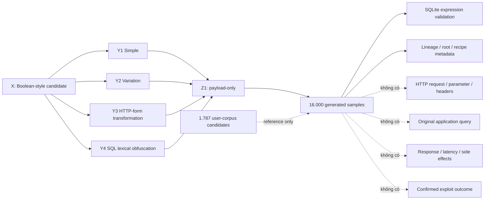
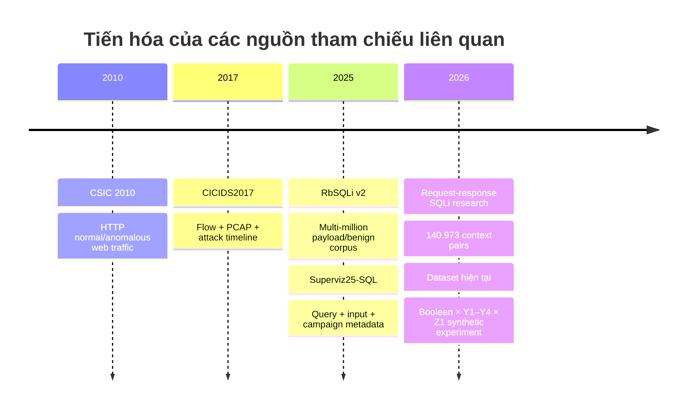

# Đánh giá độ toàn diện của bộ dữ liệu Boolean SQLi — No Context — 16.000 mẫu

## Tóm tắt điều hành

**Kết luận chính:** bộ dữ liệu hiện tại **không toàn diện cho bài toán phát hiện SQL Injection trong môi trường thực tế**, nhưng **được thiết kế khá chặt chẽ cho một thí nghiệm hẹp**: `Boolean-style SQLi candidate × Y1–Y4 × Z1 payload-only`, với 16.000 mẫu synthetic, 800 root IDs, 25 predicate kinds và kiểm tra cú pháp/chân trị bằng SQLite. Tài liệu của chính bộ dữ liệu cũng xác định rõ rằng cả 16.000 mẫu đều synthetic, không mẫu nào được xác nhận exploit thành công trên ứng dụng thật, và 1.787 mẫu tham chiếu cũng chưa được xác minh là lưu lượng tấn công thực. fileciteturn0file0

Nếu mục tiêu nghiên cứu là **“SeqGAN có sinh thêm các biến thể Boolean payload hợp lệ, đa dạng hơn rule-based augmentation hay không?”**, dữ liệu này là một điểm khởi đầu tốt. Nếu mục tiêu là **“train một detector SQLi production-grade cho WAF / HTTP traffic”**, hiện tại có các lỗ hổng P0: không có lớp benign/hard-negative, không có attack outcome thực, chỉ có SQLite, chỉ có Boolean-style, không có request/query/response/session context, không có test set ngoại lai đã gán nhãn, và mức đa dạng raw cao hơn đáng kể mức đa dạng sau chuẩn hóa.

Tôi đã kiểm tra trực tiếp toàn bộ các CSV trong gói ZIP. Các kiểm tra cơ bản xác nhận 16.000 `sample_id` duy nhất; 4.000 mẫu ở mỗi Y tier; 25 predicate kinds có đúng 640 mẫu mỗi kind; 800 roots có 20 mẫu/root; 8.000/8.000 predicate truth true/false; và tất cả 16.000 biểu thức đều có `lab_sqlite_expression_valid=1`. Tuy nhiên, **truth balance không phải attack/benign balance**: `lab_expression_truth=0` vẫn là SQLi-style candidate. `real_application_exploit_confirmed=false` cho toàn bộ 16.000 mẫu, đúng như README cảnh báo. fileciteturn0file0

Sau một phép chuẩn hóa bảo thủ do tôi thực hiện — URL-decode một lần, bỏ SQL comments, lowercase và collapse whitespace — 16.000 chuỗi raw chỉ còn khoảng **7.500 dạng lexical chuẩn hóa**. Đặc biệt, Y3 có 4.000 chuỗi raw nhưng chỉ khoảng **1.000 dạng chuẩn hóa**, Y4 khoảng **1.500**. Đây không phải chứng minh AST-equivalence tuyệt đối, nhưng là dấu hiệu mạnh rằng “16.000 unique strings” đang **phóng đại mức đa dạng ngữ nghĩa/biểu diễn có ích cho học máy**.

Đánh giá theo các chiều mà yêu cầu đặt ra:

| Chiều đánh giá | Kết luận hiện tại | Mức rủi ro cho detector production |
|---|---|---|
| Taxonomy lớp | Tốt trong phạm vi Boolean/Y1–Y4; rất thiếu nếu gọi là SQLi tổng quát | **Rất cao** |
| Cân bằng lớp | Hoàn hảo theo Y/predicate/truth do generator; **không có attack-vs-benign balance** | **Rất cao** |
| Intra-class variability | Có biến thể literal/rendering; nhiều tương quan template mạnh | **Cao** |
| Inter-class separability | Y3/Y4 khá dễ phân biệt bằng cue bề mặt; Y1/Y2 chồng lấn | **Trung bình–cao** |
| Feature coverage | Payload text tốt; metadata generator có; thiếu HTTP/query/response/runtime context | **Rất cao** |
| Rare/edge cases | Rất hạn chế; phân phối quá đều nên gần như loại bỏ “long tail” tự nhiên | **Cao** |
| Temporal/geographic | Không có | **Không đánh giá được** |
| Annotation consistency | Nội bộ rất tốt | **Thấp** cho consistency |
| Construct validity của nhãn | Chưa xác nhận exploit/app behavior | **Rất cao** |
| Label noise | Synthetic labels có noise thấp; “malicious/attack thật” chưa được chứng minh | **Cao** |
| Dataset size | Đủ cho controlled experiment; không đủ chứng minh generalization production | **Cao** |
| Drift | Cao khi chuyển DBMS/WAF/framework/normalization pipeline | **Cao** |
| Demographic/fairness | Không có demographic features; fairness production chưa thể đánh giá | **Không đánh giá được** |
| Legal/privacy | 16k synthetic rủi ro thấp; provenance/license của 1.787 corpus cần làm rõ | **Trung bình** |
| Khả năng benchmark SeqGAN augmentation | Khá tốt nếu split lineage đúng | **Khả thi ngay** |

Điểm quan trọng nhất về taxonomy là SQLi ngoài thực tế rộng hơn Boolean tautology rất nhiều. OWASP mô tả cả in-band, out-of-band và inferential/blind; OWASP CRS hiện có các rule riêng cho Boolean tautologies, time-based primitives, UNION, database functions, JSON SQL injection, comments và các kỹ thuật khác. PortSwigger cũng cho thấy khác biệt đáng kể giữa Oracle, Microsoft SQL Server, PostgreSQL và MySQL ở comments, stacked queries, time delays, string functions và nhiều primitives khác. citeturn4search3turn3search0turn6search0 Vì vậy, **“comprehensive Boolean representation corpus” và “comprehensive SQLi detection corpus” là hai tuyên bố rất khác nhau**.

## Phương pháp đánh giá

Tôi sử dụng bốn lớp kiểm tra bổ sung nhau.

**Kiểm toán schema và provenance.** Tôi đối chiếu `generated_samples.csv`, `root_grammars.csv`, `structure_cells.csv`, `grammar_slots.csv` và `validation_provenance.csv` ở bốn thư mục Y. Mỗi tier có 4.000 generated rows, 200 roots, 400 structure cells, 600 slot records và 4.000 provenance rows. Các `sample_id` giữa generated/provenance khớp 1:1; toàn bộ roots có đúng số lượng dự kiến. Missing values trong generated data chỉ tập trung ở `source_corpus_row`, hợp lý vì 16.000 mẫu không được copy trực tiếp từ corpus nguồn. Thiết kế này phù hợp với contract được mô tả trong README. fileciteturn0file0

**Kiểm toán cú pháp và construct validity.** SQLite là oracle hợp lý để xác minh các constructs mà generator tuyên bố hỗ trợ. Tài liệu SQLite xác nhận `LIKE`, `GLOB`, `IN`, `BETWEEN`, `IS`, Boolean expressions và các operator tương ứng; SQLite cũng xác nhận comments được parser xử lý như whitespace tại những vị trí whitespace hợp lệ. Do đó, validation hiện tại có cơ sở tốt cho câu hỏi “fragment này có hợp lệ dưới SQLite lab assumptions hay không?”. citeturn4search4turn4search0 Nhưng điều đó không nâng được nhãn thành “successful SQL injection”: một SQLi vulnerability đòi hỏi input phải thay đổi query mà ứng dụng xây dựng, trong khi prevention chuẩn dựa trên việc phân tách code/data bằng parameterized queries. citeturn4search1turn6search5

**Phân tích thống kê và độ đa dạng.** Tôi đo class counts, unique strings, payload length, lexical normalization và overlap với 1.787 source-corpus candidates. Phép normalization dùng ở đây chỉ nhằm kiểm tra redundancy, không được dùng như “ground-truth SQL canonicalizer”: percent-decode một lần, loại comments, lowercase, collapse whitespace. Chính vì đây là phép gần đúng, con số 7.500 nên hiểu là **cảnh báo redundancy tối thiểu**, không phải số AST độc lập.

**Model-based sanity tests.** Tôi huấn luyện một baseline nhẹ `character TF-IDF 3–5 gram + Logistic Regression` để dự đoán Y1–Y4. Đây **không phải detector SQLi**; nó chỉ trả lời câu hỏi “các tầng representation có separable không, và separability có sống sót khi giữ lại recipe chưa từng thấy không?”. Tôi cũng dùng nearest-neighbor cosine similarity trong cùng TF-IDF space để so corpus synthetic với 1.787 mẫu tham chiếu.

Pipeline kiểm định phù hợp nên được hiểu theo quan hệ sau:

Cách phân tách Z1 khỏi Z2/Z3 trong thiết kế là hợp lý về mặt nghiên cứu. Blind SQL injection thực tế phụ thuộc vào việc quan sát khác biệt response, lỗi, timing hoặc out-of-band interactions; payload-only không thể tự xác nhận các hiện tượng này. PortSwigger mô tả rõ các cơ chế conditional response, conditional errors, time delay và OAST đều cần hành vi của application/DBMS sau request. citeturn6search1 Một nghiên cứu năm 2026 cũng xây dựng 140.973 request-response pairs và báo cáo cải thiện đáng kể so với payload-only models, củng cố lý do nên bổ sung Z2 thay vì cố nhồi mọi thông tin vào chuỗi payload. Đây là bằng chứng nghiên cứu, chưa phải lý do để coi một kiến trúc cụ thể là mặc định production. citeturn10view1

## Kết quả về phạm vi, taxonomy và chất lượng dữ liệu

**Taxonomy completeness.** Trong phạm vi đã tuyên bố, coverage khá có hệ thống: 25 predicate kinds × 8 recipes × bốn tier, gồm numeric comparisons, string comparisons, `BETWEEN`, `IN`, `LIKE`, `GLOB`, NULL semantics và arithmetic. Đây là một ưu điểm rõ rệt so với corpus được thu gom ngẫu nhiên: coverage có thể truy vết bằng root và slot.

Nhưng nó chỉ bao phủ **một lát cắt của không gian SQLi**. Các khoảng trống lớn gồm UNION-based, error-based, time-based, stacked/batched, inline/subquery extraction, out-of-band, authentication-bypass contexts, second-order SQLi, JSON/XML input contexts, stored-procedure/dynamic SQL contexts và các dialect-specific constructs. OWASP CRS hiện bao gồm không chỉ Boolean comparisons mà còn time-based patterns, UNION, database functions, MySQL-specific comments, JSON-oriented SQLi và nhiều nhóm khác. citeturn3search0 PortSwigger cho thấy ngay cả các primitives cơ bản như comments, concatenation, time delays và stacked queries cũng khác nhau giữa Oracle, SQL Server, PostgreSQL và MySQL. citeturn6search0

Do đó taxonomy hiện tại nên được mô tả là:

> **“Boolean-style representation-augmentation corpus for SQLite-validated Z1 experiments”**

chứ không nên đặt claim:

> **“comprehensive SQL injection dataset.”**

**Class balance và distribution.** Y1–Y4 chính xác 4.000 mẫu/tier; 25 predicate kinds chính xác 640 mẫu/kind; mỗi variant V01–V08 có 500 mẫu/tier; mỗi root có 20 mẫu. Đây là balance tuyệt đối do generator tạo ra. Nó có lợi cho ablation vì loại confound class frequency, nhưng đồng thời **không đại diện cho prevalence trong thực tế**. Production SQLi detection thường là một bài toán rất imbalanced, và dataset tốt phải kiểm tra cả precision/false-positive rate trong base rate thấp. Superviz25-SQL cố ý dùng test distribution 90% benign / 10% malicious; họ cũng có hơn ba triệu benign test queries để kiểm tra false alarms. citeturn9view0

Điểm nguy hiểm nhất là dữ liệu hiện tại **không có class `benign`**. 8.000 `truth=0` không thể làm negative class. Đây là nguyên tắc đã ghi rõ trong README, và phải được enforce bằng code để người dùng sau không vô tình biến “false SQL predicate” thành “benign request”. fileciteturn0file0

**Intra-class variability.** 16.000 payload raw đều unique, nhưng uniqueness bề mặt không đồng nghĩa information diversity. Kết quả của tôi:

| Tier | Số mẫu | Raw unique | Lexical-normalized unique* | Độ dài trung bình | P95 độ dài | Max |
|---|---:|---:|---:|---:|---:|---:|
| Y1 | 4.000 | 4.000 | 4.000 | 32,2 | 48 | 58 |
| Y2 | 4.000 | 4.000 | 4.000 | 30,2 | 44 | 54 |
| Y3 | 4.000 | 4.000 | **1.000** | 35,9 | 75 | 120 |
| Y4 | 4.000 | 4.000 | **1.500** | 33,3 | 47 | 59 |
| Toàn bộ | 16.000 | 16.000 | **7.500** | — | — | — |

\*Normalization gần đúng của phân tích này, không phải AST equivalence proof.

Y3 đặc biệt cho thấy nhiều recipes chỉ tạo ra khác biệt ở encoding layer rồi hội tụ sau decode. Điều này là đúng với ý nghĩa thí nghiệm của Y3, nhưng có nghĩa rằng “4.000 variants” không nên được sử dụng như bằng chứng có 4.000 mechanisms.

**Inter-class separability.** Y1 và Y2 có ranh giới yếu hơn đáng kể so với Y3/Y4. Điều này hợp lý: Y2 chủ yếu là syntactic variation của logic trực tiếp; Y3 có `%xx`/form-encoding cues rất rõ; Y4 có comment markers rất rõ. Nếu mục tiêu cuối là binary SQLi detector, model không nên được thưởng quá nhiều vì chỉ học “có `%20` → Y3” hoặc “có `/**/` → Y4”. OWASP CRS thực tế thực hiện transformations như URL decoding và comment replacement trước/đồng thời với một số SQLi rules, cho thấy canonicalization layer là một phần trọng yếu của hệ thống phòng thủ. citeturn3search0

**Feature coverage.** Text coverage tốt trong đúng nghĩa “payload string”. Có categorical metadata như tier, predicate, representation, root, variant và dialect; có một vài binary/numeric validation fields. Nhưng những metadata đó phần lớn mô tả **generator**, không mô tả request thực tế. Không có HTTP method, parameter location, content type, endpoint, headers, cookies, body encoding chain, original SQL query/template, query execution result, response status/length, latency, WAF score, session history, DBMS/version hoặc vulnerable sink.

“Image coverage” bằng không, nhưng **đây không phải thiếu sót đáng quan tâm cho SQLi**; images không phải modality tự nhiên của task. Những modality cần ưu tiên là request/query/response/runtime metadata. CICIDS2017, dù quá rộng và cũ để làm SQLi benchmark chính, minh họa một benchmark có timestamp, source/destination, ports, protocols, labeled flows và packet captures; SQL injection được thực thi trong một khoảng thời gian cụ thể của kịch bản web attack. citeturn4search2turn7view0

**Edge cases và rare classes.** Gần như không có “rare class” đúng nghĩa bởi generator áp phân phối đều. Đây là một nghịch lý: balance tốt cho thí nghiệm nhưng xóa long tail. Nên bổ sung malformed-but-benign inputs, half-encoded inputs, double encoding, Unicode confusables, extremely long parameters, SQL-looking source-code snippets, natural-language sentences có `AND/OR/LIKE`, UUID/token/date expressions, search syntax, JSON strings, ORM filters, log fragments và benign URLs có `%xx`/comments. Những hard negatives này đặc biệt quan trọng vì WAF SQLi rules có lịch sử phải đánh đổi detection với false positives; chính dự án CRS chủ động tiếp nhận báo cáo cả false positive lẫn evasion. citeturn3search1

**Annotation quality và label noise.** Có hai kết luận trái chiều nhưng đều đúng:

1. **Metadata/grammar annotation quality: cao.** Lineage rõ, IDs nhất quán, validation 1:1, expected truth khớp observed truth.
2. **Attack-ground-truth quality: thấp/chưa có.** Không mẫu nào được confirmed exploit trên application thật.

Điều này tốt hơn việc âm thầm gắn nhãn synthetic thành real attack; README đã xử lý epistemic boundary đúng cách. fileciteturn0file0 Nhưng khi downstream model nhận một cột `label=attack`, việc mất distinction này rất dễ xảy ra. Superviz25-SQL là một ví dụ đáng tham khảo về datasheet chi tiết: họ cung cấp `attack_status`, `attack_stage`, `attack_technique`, query template và campaign identifier; đồng thời thừa nhận sqlmap đôi khi gửi queries không có malicious payload và đã loại 8.233 contradictory instances. citeturn9view0 Đây là loại transparency mà phiên bản Z2 nên hướng tới.

## Phân tích thống kê, baseline classifiers và OOD

Các baseline dưới đây không đánh giá “SQLi detection accuracy”; chúng đo **khả năng phân biệt tầng Y**. Kết quả như sau:

| Thí nghiệm | Split | Accuracy | Macro-F1 | Diễn giải |
|---|---|---:|---:|---|
| IID baseline | Random stratified 80/20 | **89,88%** | **89,87%** | Khá cao nhưng có family/template similarity |
| Group CV theo predicate family | Giữ các `P01…P25` cùng group | **93,75%** | **93,73%** | Tier cues mạnh, đặc biệt Y3/Y4 |
| Group CV theo root lineage | Toàn root nằm cùng fold | **93,75%** | **93,72%** | Không loại được representation cues |
| Leave-one-variant-out | Giữ hẳn một V01…V08 ngoài training | **76,72%** | **76,73%** | Generalization sang recipe chưa thấy suy giảm rõ |

Leave-one-variant-out là test có giá trị nhất ở đây. Aggregate confusion matrix là:

Chi tiết recall: Y1 khoảng **81,6%**, Y2 **75,0%**, Y3 chỉ **50,3%**, trong khi Y4 **100%** trong thử nghiệm này. Theo từng variant bị giữ lại, accuracy dao động khoảng **50% đến 100%**. Điều đó cho thấy model có thể học mạnh các đặc trưng representation cụ thể thay vì một khái niệm “complexity level” thật sự bền vững.

Đây cũng là lý do **random sample split không nên là headline result**. README của dataset đã khuyến cáo group split theo root/predicate/representation; kết quả thực nghiệm ở trên xác nhận khuyến cáo này là đúng. fileciteturn0file0

Một phát hiện đáng lo hơn đến từ 1.787 corpus candidates. Không có payload nào exact-match với 16.000 synthetic strings, kể cả sau lexical normalization của tôi. Khi dùng char-TFIDF và đo **maximum cosine similarity tới bất kỳ synthetic sample nào**, corpus tham chiếu có:

| Chỉ số OOD | Giá trị |
|---|---:|
| Mean max similarity | **0,253** |
| Median | **0,253** |
| P95 | **0,324** |
| Maximum | **0,475** |
| Tỷ lệ dưới 0,30 | **79,35%** |
| Tỷ lệ dưới 0,40 | **99,38%** |

Trong khi đó, synthetic payloads thuộc một recipe V chưa thấy nhưng so với training recipes còn lại có mean nearest-neighbor similarity khoảng **0,866**. Hai phân phối tách rất xa:

Kết luận cần thận trọng: điều này **không chứng minh 1.787 mẫu chứa các kỹ thuật SQLi hoàn toàn mới**. Corpus reference có chiều dài trung bình khoảng 86 ký tự, so với khoảng 30–36 ký tự của synthetic fragments, nên khoảng cách có thể phản ánh sự khác biệt giữa **full/longer SQL-like inputs và short Boolean fragments**. Nhưng chính điều đó cũng là một gap production quan trọng: detector phải đối mặt với payload trong nhiều context/length khác nhau.

Đối với OOD test production, tôi khuyến nghị ba tầng:

1. Fit representation trên training synthetic + curated benign, sau đó dùng kNN distance / Mahalanobis / Isolation Forest / one-class model để flag low-density regions.
2. Đặt **entire source** ngoài training: ví dụ không để bất kỳ samples từ cùng generator/repository xuất hiện ở cả train và test.
3. Cuối cùng, đánh giá trên **controlled app-lab + held-out external dataset**, không tune threshold trên test.

Về ROC/PR: hiện tại **không có cơ sở để vẽ attack-vs-benign ROC/PR curve**, vì không có benign label. Sau khi có lớp benign, nên ưu tiên PR-AUC hơn ROC-AUC khi deployment base rate thấp, đồng thời báo cáo `Recall @ fixed FPR`, `Precision @ deployment prevalence`, FPR per million requests và calibration. Với multi-family classification, vẽ one-vs-rest class-wise ROC/PR nhưng giữ family/campaign/source groups nguyên vẹn giữa folds.

Confusion matrix production nên là ít nhất:

`benign / Boolean / Union / Error / Time / Stacked / Other-SQLi / OOD`

thay vì chỉ Y1–Y4; Y nên trở thành **secondary attribute** hoặc multi-label dimension hơn là attack family chính.

## So sánh với các bộ dữ liệu tham chiếu

Không có một public SQLi dataset nào tự động trở thành “gold standard”; mỗi benchmark giải một bài toán khác. Tuy nhiên, các bộ dưới đây cho thấy rõ những chiều mà corpus hiện tại còn thiếu.

| Dataset | Quy mô / phân phối | Taxonomy | Context | Validation / provenance | Giá trị so sánh với corpus hiện tại |
|---|---|---|---|---|---|
| **Corpus hiện tại** | 16.000 synthetic; 0 benign; 1.787 candidates ngoài corpus chính | Boolean only; 25 predicates; Y1–Y4 | Payload-only Z1 | SQLite expression validity; 0 confirmed application exploit | Tốt nhất cho controlled representation augmentation |
| **RbSQLi v2** | **10.304.026** rows; 2.813.146 malicious, 7.490.880 benign | 6 SQLi classes; 226.080 Boolean | Payload/query-oriented | Open-source + AI-generated + rule labeling | Dùng để mở rộng taxonomy, balance và external-source testing |
| **Superviz25-SQL** | **3.688.977** instances; train 335.306 benign; test 3.017.390 benign + 336.281 malicious | Boolean, error, inline, stacked, time, union, insider | Full query + user input + campaign/template metadata | MySQL lab, sqlmap campaigns, attack status | Comparator mạnh cho benign FPR, template/campaign splits, multi-family |
| **CICIDS2017** | Network benchmark nhiều ngày, benign + nhiều attack families | SQLi là một phần nhỏ của Web Attack | Network flows/PCAP, timestamps, hosts/protocols | Controlled attack schedule | Hữu ích cho context/drift/network features; không phù hợp làm SQLi payload benchmark chính |
| **2026 request-response research corpus** | 140.973 labeled request-response pairs | SQLi detection | Request + response | Honeypot/multi-agent controlled framework | Bằng chứng rằng Z2 context đáng nghiên cứu |

RbSQLi công bố 10.304.026 entries, trong đó 2.813.146 malicious và 7.490.880 benign; malicious data gồm Union, stacked queries, time, meta, Boolean và error-based classes. Tuy nhiên, provenance của nó cũng là hỗn hợp open-source payloads và ChatGPT generation, với rule-based classification, nên quy mô lớn **không đồng nghĩa ground truth thực địa**. Nó được phát hành CC BY 4.0. citeturn10view0

Superviz25-SQL đặc biệt hữu ích làm reference vì nó có binary benign/malicious labels, user input và full query, attack technique, attack campaign, tamper method và attack status. Dataset được tạo trên MySQL; normal queries được kiểm tra bằng MySQL; attack campaigns dùng sqlmap trên simulated vulnerable endpoints. Tác giả cũng công khai các giới hạn annotation và redundancy. Dataset được phát hành MIT. citeturn9view0turn7view2

CICIDS2017 không phải comparator payload-level trực tiếp, nhưng official UNB page cho biết dataset chứa benign traffic, PCAPs/flows và attack labels; traffic được thu trong năm ngày, trong đó Web Attack SQL Injection được thực hiện vào ngày 6 tháng 7 năm 2017. Điều này vừa là ưu điểm về context vừa là nhược điểm về temporal freshness — nó không nên đại diện cho attack distribution năm 2026. citeturn4search2turn7view1

Sự phát triển của các reference points có thể nhìn như sau:

Xu hướng quan trọng không phải đơn thuần “dataset ngày càng lớn”, mà là **tách provenance, campaign/template lineage, benign workload, exploit outcome và context thành first-class metadata**. Superviz25 làm điều này rõ ràng hơn nhiều so với các corpus chỉ có `text,label`. citeturn9view0

## Drift, fairness, temporal/geographic representativeness và pháp lý

**Temporal representativeness: không có.** Ngày tạo 2026-09-24 là metadata của generator chứ không phải sampling period của attack traffic. Không có timestamp per observation, do đó không thể đo seasonal drift, concept drift hoặc attack-evolution drift. OWASP CRS tiếp tục thay đổi và bổ sung detection logic, bao gồm các SQLi patterns rất rộng; một dataset tĩnh cần được version hóa và đánh giá định kỳ trên rules/traffic mới. citeturn3search0turn3search1

Nên tạo temporal protocol kiểu:

`train ≤ T0` → `validation T0+1` → `future test T0+2`

cho real/lab campaigns, thay vì random shuffle. Các generator rules cũng phải có `generator_version`, `created_at`, `source_snapshot`, `DBMS_version` và `normalization_pipeline_version`.

**Geographic representativeness: không áp dụng trực tiếp cho synthetic payloads, nhưng chưa thể đánh giá production representativeness.** SQL syntax không “thuộc quốc gia”, nhưng benign HTTP traffic lại phụ thuộc locale, ngôn ngữ, encoding, application domain, mobile/client populations và content conventions. Một detector được train trên benign English ASCII có thể gắn điểm rủi ro sai cho dữ liệu Unicode, search expressions hoặc developer-oriented endpoints. Vì hiện không có benign traffic, không thể đo các subgroup FPR đó.

**Fairness/demographic considerations.** Dataset không chứa tuổi, giới, chủng tộc hoặc các protected attributes, nên không có demographic imbalance trực tiếp. Tuy nhiên, fairness của security classifier thường xuất hiện gián tiếp qua locale/language, customer segment, endpoint và traffic patterns. NIST AI RMF khuyến nghị quản lý risk xuyên toàn lifecycle thay vì chỉ đánh giá aggregate accuracy. citeturn8search11turn8search17 Với WAF, fairness audit thực dụng hơn là báo cáo FPR theo `language/locale`, country/region nếu hợp pháp, application/product, API vs web, authenticated vs anonymous, mobile vs browser, và customer tier.

**Privacy.** 16.000 synthetic payloads hiện có rủi ro privacy thấp vì không chứa captured request/session/person data theo mô tả dataset. Rủi ro thay đổi hoàn toàn khi thêm production logs. IPs, cookies, account IDs, request bodies, emails và combinations có thể là personal data. European Commission nhấn mạnh các nguyên tắc purpose limitation, data minimisation, storage limitation, accuracy, integrity/confidentiality; pseudonymized data vẫn có thể là personal data nếu có khả năng tái nhận dạng. citeturn8search0turn8search3 Vì vậy Z2/Z3 collection nên mặc định hash/tokenize identifiers, redact credentials, drop unrelated body fields, áp retention period và access controls.

**Licensing/IP.** `source_catalog.csv` cho biết 16.000 rows không copy trực tiếp các public references, giúp giảm rủi ro contamination/license cho corpus chính. Nhưng 1.787 user-provided records có origin chưa xác nhận; trước khi redistribute hoặc nhập chúng vào một public/released training set cần xác định license, provenance và quyền sử dụng. Đây là gap pháp lý thực tế hơn privacy của 16.000 synthetic samples. fileciteturn0file0 Để so sánh, RbSQLi công khai CC BY 4.0, còn Superviz25-SQL công khai MIT, giúp downstream usage rõ ràng hơn. citeturn10view0turn7view2

**Security/legal scope.** Payload corpus nên được giữ trong controlled research environment và documentation phải tiếp tục nhấn mạnh defense/evaluation scope. Quan trọng hơn, một detector không thay thế prevention tại application layer: OWASP khuyến nghị prepared statements/parameterized queries là defense chính; input detection/WAF là defense bổ sung. citeturn4search1

## Danh sách khoảng trống ưu tiên và khuyến nghị cụ thể

Ước lượng effort dưới đây giả định một nhóm nhỏ khoảng 1–2 kỹ sư/nghiên cứu viên có sẵn pipeline Python và lab infrastructure cơ bản; đây là **planning estimates**, không phải cam kết lịch triển khai.

| Ưu tiên | Khoảng trống | Hành động cụ thể | Effort ước tính | Tác động kỳ vọng |
|---|---|---|---|---|
| **P0** | Không có benign/hard negatives | Thu 20k–100k benign payload/request values; stratify theo text, numeric, URLs, search, code snippets, JSON, Unicode; thêm hard negatives giống SQL | 3–10 ngày với public/lab data; 2–4 tuần nếu production governance | **Rất cao** — mới cho phép precision/FPR/PR-AUC có ý nghĩa |
| **P0** | Không có confirmed attack outcome | Xây vulnerable app lab; ghi input → query → DBMS execution → response/outcome | 2–4 tuần | **Rất cao** — nâng construct validity |
| **P0** | Chỉ SQLite | Chạy cùng campaign trên PostgreSQL, MySQL/MariaDB, SQL Server; tách `dialect` rõ | 1–3 tuần/DBMS ban đầu | **Rất cao** |
| **P0** | Test set cùng generator distribution | Tạo immutable external held-out test từ Superviz/RbSQLi subset + manually reviewed corpus; tuyệt đối không augment test | 3–7 ngày integration + review | **Rất cao** |
| **P0** | 1.787 reference candidates chưa xác nhận | Double-review / adjudication: Boolean candidate? attack payload? benign? unknown? dialect? full-query vs fragment? | khoảng 4–8 người-ngày cho 1.787 rows nếu tooling tốt | **Rất cao** |
| **P1** | SQLi taxonomy quá hẹp | Bổ sung Union, error, time, stacked, inline/subquery, authentication bypass, OOB; giữ X multi-label | 2–4 tuần vòng đầu | **Cao** |
| **P1** | Y3/Y4 redundancy | Thêm AST/parse-tree canonical hashes, operator coverage, function coverage và semantic execution signatures | 1–2 tuần | **Cao** |
| **P1** | Không có Z2 | Lưu HTTP method, endpoint template, parameter position, content type, decode chain, query template, response status/body features, latency | 2–4 tuần | **Cao** |
| **P1** | Encoding/obfuscation long tail yếu | Bổ sung Y5 có controlled nested encoding, Unicode/canonicalization, DBMS-specific comments; validate pipeline-order | 1–3 tuần | **Cao** |
| **P1** | Split leakage risk | Tạo official split manifests: IID, root-held-out, predicate-held-out, transform-held-out, source-held-out, temporal-held-out | 2–4 ngày | **Cao**, effort thấp |
| **P1** | Annotation semantics dễ bị dùng sai | Thêm explicit fields `attack_candidate`, `syntax_valid`, `behavior_validated`, `exploit_success`, `benign_confirmed` thay vì một label | 2–5 ngày schema + migration | **Cao** |
| **P2** | Không có drift monitoring | Snapshot hàng tháng/quý, external replay, PSI/JSD/embedding-distance dashboards, failure bucket review | 1 tuần setup + định kỳ | **Trung bình–cao** |
| **P2** | Fairness chưa đo được | Xây multilingual/Unicode benign suite; báo subgroup FPR theo locale/app/client | 1–2 tuần | **Trung bình** |
| **P2** | Provenance/license chưa đầy đủ | Data card per source: owner, license, acquisition date, allowed uses, redistribution, hash | 2–5 ngày + legal review nếu cần | **Cao** cho publication/product |

Checklist “gate” trước khi dùng bộ dữ liệu để tuyên bố detector production-ready nên là:

- **Không công bố attack detection accuracy** cho tới khi có benign/hard-negative test set độc lập.
- **Không dùng `truth=0` làm benign.**
- **Không random-split các descendants của cùng root/source qua train và test.**
- **Không báo 16.000 unique strings như 16.000 independent attack mechanisms.**
- **Không dùng 1.787 source candidates như ground truth trước manual/behavioral validation.**
- **Không claim multi-DBMS generalization từ SQLite-only validation.**
- **Không tune SeqGAN/model hyperparameters trên external final test.**
- **Luôn giữ baseline `no augmentation`, naive duplication, rule augmentation và SeqGAN augmentation ở cùng train budget.**
- **Báo cả FPR, PR-AUC, calibration, p50/p95/p99 latency, throughput, memory/CPU và escalation rate**, không chỉ recall/accuracy.

Thiết kế thí nghiệm augmentation được khuyến nghị là:

| Arm | Training data | Mục đích |
|---|---|---|
| A | Reviewed originals only | Baseline thật |
| B | A + random duplication | Kiểm soát hiệu ứng “nhiều rows hơn” |
| C | A + current grammar augmentation | Baseline augmentation có kiểm soát |
| D | A + SeqGAN augmentation | Đo incremental value của generative model |
| E | A + grammar + SeqGAN diversity filter | Kiểm tra hybrid approach |

Tất cả arms phải dùng **cùng immutable source-held-out/temporal-held-out test sets** và cùng benign distribution. Với SeqGAN, không nên dùng “fraction unique strings” làm metric chính. Nên đo `validity`, `novelty vs lineage`, AST/semantic diversity, nearest-neighbor distance, DBMS execution validity, family coverage, downstream recall/FPR gain và duplication-adjusted effective sample size.

Về kích thước, **16.000 mẫu không phải quá nhỏ cho controlled ablation**: 800 roots × 20 samples cho phép đo variation khá sạch. Nhưng kích thước không phải bottleneck chính. Thêm 1 triệu payload khác từ cùng 800 templates sẽ ít giá trị hơn nhiều so với thêm vài chục nghìn **benign, context-rich, cross-DBMS, independently sourced và behaviorally validated samples**. Các benchmark lớn hơn minh họa điều này: RbSQLi có hơn 10 triệu records nhưng vẫn chủ yếu dựa trên curated/generated payloads, trong khi Superviz25-SQL có giá trị đặc biệt nhờ full query, benign workload, template/campaign lineage và technique/status metadata. citeturn10view0turn9view0

**Đánh giá cuối cùng:** bộ dữ liệu hiện tại có chất lượng kỹ thuật **tốt cho một benchmark nội bộ về controlled Boolean SQLi representation augmentation**, đặc biệt nhờ typed grammar, lineage IDs và SQLite validation. Nhưng mức độ toàn diện cho “SQLi classification/detection” hiện chỉ ở giai đoạn nền móng. Nút thắt không phải số mẫu mà là **ground truth, negatives, context, dialect breadth, independent test sources và semantic diversity**. Ưu tiên đúng là chuyển từ triết lý **“Generated = nhiều dữ liệu”** sang **“Independent + behaviorally validated + representative = dữ liệu có giá trị”**, đúng với cảnh báo cốt lõi trong chính tài liệu dataset: *Generated ≠ Validated ≠ Useful*. fileciteturn0file0