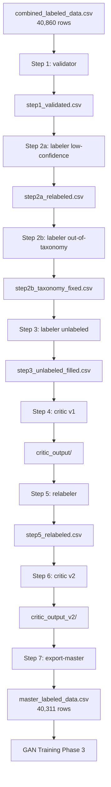

# RECOVERY PLAN — SQLi Labeling Pipeline Rebuild

> **Ngày tạo:** 2026-05-10  
> **Cập nhật lần cuối:** 2026-05-10  
> **Mục đích:** Tài liệu khôi phục toàn bộ labeling pipeline — code Python CLI, rule-based, không phụ thuộc LLM API  
> **Trạng thái:** ✅ Đã implement — 18 files, ~2,000 LOC  
> **Kết quả:** Master dataset 40,311 rows, REJECT rate 1.3%  
> **Dự án:** GAN_SQLi — SeqGAN/Gumbel-Softmax/VAE-GAN cho SQL Injection payload generation

---

## Mục Lục

1. [Tổng quan dự án và kết quả](#1-tổng-quan-dự-án-và-kết-quả)
2. [Kiến trúc tổng thể](#2-kiến-trúc-tổng-thể)
3. [Cấu trúc thư mục (18 files)](#3-cấu-trúc-thư-mục-18-files)
4. [Pipeline 7 bước](#4-pipeline-7-bước)
5. [Skill 1: sqli-label-validator](#5-skill-1-sqli-label-validator)
6. [Skill 2: sqli-labeler](#6-skill-2-sqli-labeler)
7. [Skill 3: sqli-label-critic](#7-skill-3-sqli-label-critic)
8. [Signal patterns đã mở rộng](#8-signal-patterns-đã-mở-rộng)
9. [Cách detect theo từng type](#9-cách-detect-theo-từng-type)
10. [8 checks của critic — chi tiết](#10-8-checks-của-critic--chi-tiết)
11. [Kết quả thực tế trên 40,860 rows](#11-kết-quả-thực-tế-trên-40860-rows)

---

## 1. Tổng quan dự án và kết quả

### Dự án GAN_SQLi

Sinh **SQL Injection payloads tổng hợp** dùng GAN (SeqGAN / Gumbel-Softmax / VAE-GAN). Ba phase:

```
Phase 1 — Data Engineering: Collect → Clean → Normalize         ✅ Done
  Output: master_unlabeled.csv (46,906 rows)

Phase 2 — AI Labeling: Split → AI classify → Merge              ✅ Đã cải thiện
  Input:   combined_labeled_data.csv (40,860 rows, label từ AI cũ)
  Output:  master_labeled_data.csv (40,311 rows, label đã kiểm định)

Phase 3 — GAN Training: SeqGAN / Gumbel-Softmax / VAE-GAN       ❌ Chưa bắt đầu
```

### Kết quả pipeline

| Giai đoạn | REJECT | FLAG | PASS |
|-----------|-------:|-----:|-----:|
| Critic v1 (patterns cơ bản) | 6,592 (16.1%) | 19,336 (47.3%) | 12,343 (30.2%) |
| Sau re-label rule-based | **549 (1.3%)** | 20,719 (50.7%) | 19,592 (47.9%) |

- **Master dataset**: 40,311 rows (PASS + FLAG), 9.1 MB
- **REJECT cuối cùng**: 549 rows (1.3%) — cần human review
- **Benign FN rate**: 5.6% (giảm từ 8.2%)
- **0% LLM API** — toàn bộ rule-based

### Phân phối type cuối cùng

| Type | Rows | % |
|------|-----:|---:|
| benign | 20,538 | 50.9% |
| error_based | 7,551 | 18.7% |
| boolean_blind | 5,439 | 13.5% |
| union_based | 2,287 | 5.7% |
| time_blind | 1,472 | 3.7% |
| heavy_query | 1,407 | 3.5% |
| rce | 1,199 | 3.0% |
| out_of_band | 254 | 0.6% |
| stacked_queries | 110 | 0.3% |
| unknown | 48 | 0.1% |
| auth_bypass | 6 | <0.1% |
| **TOTAL** | **40,311** | **100%** |

---

## 2. Kiến trúc tổng thể



### Luồng dữ liệu

```
combined_labeled_data.csv (40,860 rows)
payload_norm, sqli_type, db_engine, confidence, reasoning

    ▼ [Step 1: sqli-label-validator]
    R1: Normalize boolean_based → boolean_blind (1,825 rows)
    R2: Map out-of-taxonomy → type by payload (3 rows)
    R3: Fix ldap_injection → unknown, command_injection → rce (5 rows)
    R4: DB engine conflict detection (14 rows)
    R5: Confidence range check
    R6: Reasoning quality check (27,997 rows)
    Output: 29,844 corrections → step1_validated.csv

    ▼ [Step 2: sqli-labeler]
    Mode low-confidence: re-label 2,373 rows (rule-based priority chain)
    Mode out-of-taxonomy: re-label 137 rows
    Mode unlabeled: pass-through (all rows already labeled)
    Priority chain P1→P14 với patterns mở rộng

    ▼ [Step 4: critic v1]
    8 checks (C1-C8): 12,343 PASS, 19,336 FLAG, 9,181 REJECT
    REJECT rows có correction_json (sqli_type gợi ý)

    ▼ [Step 5: relabeler] ← QUAN TRỌNG
    Áp dụng correction_json từ critic (3,381 rows)
    Chạy classifier cải tiến cho rows còn lại (5,800 rows)
    Output: step5_relabeled.csv (40,860 rows, 13,140 changes)

    ▼ [Step 6: critic v2]
    19,592 PASS, 20,719 FLAG, 549 REJECT (1.3%)
    FAIL rate giảm từ 22.5% → 1.3%

    ▼ [Step 7: master_labeled_data.csv]
    40,311 rows (PASS + FLAG) → GAN Training Phase 3
```

---

## 3. Cấu trúc thư mục (18 files)

```
Skill/
├── shared/                              # Dùng chung 3 skills
│   ├── __init__.py                      # (empty)
│   ├── taxonomy.py                      # 14 types + 9 DB + priority + normalize map
│   └── patterns.py                      # Regex patterns mở rộng + DB signatures + attack keywords
│
├── sqli-label-validator/
│   ├── __init__.py                      # (empty)
│   ├── validator.py                     # CLI: validate | normalize | report
│   └── rules.py                         # 6 rules: R1-R6
│
├── sqli-labeler/
│   ├── __init__.py                      # (empty)
│   ├── labeler.py                       # CLI: label | single | batch
│   ├── classifier.py                    # Priority chain P1→P14 (patterns mở rộng)
│   ├── llm_client.py                    # LLM fallback (optional, không dùng trong practice)
│   └── relabeler.py                     # [NEW] Re-label REJECT rows từ critic corrections
│
└── sqli-label-critic/
    ├── __init__.py                      # (empty)
    ├── critic.py                        # CLI: review | audit-benign | find-conflicts | export-master
    ├── reviewer.py                      # Phase 1: 5 basic checks C1→C5
    ├── deep_review.py                   # Phase 2: deep review cho FLAG rows
    ├── auditor.py                       # Phase 3: benign audit + Phase 4: conflict resolution
    └── extended_checks.py               # C6 confidence, C7 structure (+benign text skip), C8 historical
```

### Mô tả từng file

| File | LOC | Vai trò |
|------|----:|---------|
| `shared/__init__.py` | 1 | Package init |
| `shared/taxonomy.py` | 50 | Data: 14 types, 9 DB, normalize map |
| `shared/patterns.py` | 120 | Regex patterns mở rộng, DB signatures, attack keywords (29 keywords) |
| `validator/__init__.py` | 1 | Package init |
| `validator/validator.py` | 170 | CLI dispatch + CSV I/O (xử lý BOM, quoted fieldnames) |
| `validator/rules.py` | 165 | 6 rule functions + DB_CONFLICT_MAP |
| `labeler/__init__.py` | 1 | Package init |
| `labeler/labeler.py` | 230 | CLI dispatch: label | single | batch |
| `labeler/classifier.py` | 100 | Priority chain + DB detect + confidence assign |
| `labeler/llm_client.py` | 130 | LLM API fallback (không dùng, giữ để reference) |
| `labeler/relabeler.py` | 210 | [NEW] Re-label REJECT rows từ critic corrections + classifier fallback |
| `critic/__init__.py` | 1 | Package init |
| `critic/critic.py` | 290 | CLI dispatch + orchestrator + export-master |
| `critic/reviewer.py` | 130 | 5 basic checks C1-C5 |
| `critic/deep_review.py` | 65 | Deep review FLAG rows |
| `critic/auditor.py` | 115 | Benign audit + conflict resolution |
| `critic/extended_checks.py` | 170 | C6 confidence, C7 structure (+_is_sql_like), C8 historical |
| `pipeline_run.py` | 155 | Orchestrator 7 bước |

**Tổng cộng:** ~2,010 LOC

### Dependencies

```python
# Chỉ dùng Python standard library — KHÔNG cần pip install
import argparse, csv, json, logging, random, re, sys
from collections import defaultdict
from dataclasses import dataclass, field, asdict
from pathlib import Path
from urllib.request import Request, urlopen  # cho LLM client (optional)
import importlib.util  # cho relabeler
```

---

## 4. Pipeline 7 bước

### pipeline_run.py — Orchestrator

```bash
# ============================================================
# STEP 1: Validate + normalize existing labels
# ============================================================
python Skill/sqli-label-validator/validator.py normalize ^
    Asset/LabelData/combined_labeled_data.csv ^
    --output Asset/LabelData/step1_validated.csv ^
    --corrections Asset/LabelData/step1_corrections.csv

# ============================================================
# STEP 2: Re-label low-confidence rows (rule-based)
# ============================================================
python Skill/sqli-labeler/labeler.py label ^
    Asset/LabelData/step1_validated.csv ^
    --mode low-confidence ^
    --output Asset/LabelData/step2a_relabeled.csv

# ============================================================
# STEP 3: Fix out-of-taxonomy rows
# ============================================================
python Skill/sqli-labeler/labeler.py label ^
    Asset/LabelData/step2a_relabeled.csv ^
    --mode out-of-taxonomy ^
    --output Asset/LabelData/step2b_taxonomy_fixed.csv

# ============================================================
# STEP 4: Critic review v1 (8 checks + benign audit)
# ============================================================
python Skill/sqli-label-critic/critic.py review ^
    Asset/LabelData/step2b_taxonomy_fixed.csv ^
    --extended-checks confidence,structure,historical ^
    --audit-sample 500 ^
    --output-dir Asset/LabelData/critic_output

# ============================================================
# STEP 5: Re-label REJECT rows (critic corrections + classifier)
# ============================================================
python Skill/sqli-labeler/relabeler.py ^
    Asset/LabelData/critic_output/critic_results.csv ^
    --output Asset/LabelData/step5_relabeled.csv ^
    --diff Asset/LabelData/step5_diff.csv

# ============================================================
# STEP 6: Critic review v2 (final verification)
# ============================================================
python Skill/sqli-label-critic/critic.py review ^
    Asset/LabelData/step5_relabeled.csv ^
    --extended-checks confidence,structure,historical ^
    --audit-sample 500 ^
    --output-dir Asset/LabelData/critic_output_v2

# ============================================================
# STEP 7: Export master dataset
# ============================================================
python Skill/sqli-label-critic/critic.py export-master ^
    Asset/LabelData/critic_output_v2/critic_results.csv ^
    --output Asset/LabelData/master_labeled_data.csv
```

### Các bước chạy riêng lẻ

```bash
# Validator
python Skill/sqli-label-validator/validator.py normalize input.csv --output validated.csv
python Skill/sqli-label-validator/validator.py report input.csv --output-dir ./report

# Labeler
python Skill/sqli-labeler/labeler.py single "' UNION SELECT 1, SLEEP(5) --"
python Skill/sqli-labeler/labeler.py label input.csv --mode low-confidence --output out.csv

# Critic
python Skill/sqli-label-critic/critic.py review input.csv --extended-checks confidence,structure,historical
python Skill/sqli-label-critic/critic.py audit-benign input.csv --sample 500
python Skill/sqli-label-critic/critic.py find-conflicts input.csv
python Skill/sqli-label-critic/critic.py export-master critic_results.csv --output master.csv

# Relabeler
python Skill/sqli-labeler/relabeler.py critic_output/critic_results.csv --output relabeled.csv --diff diff.csv
```

### Output files

```
Asset/LabelData/
├── step1_validated.csv            # Step 1: 40,860 rows
├── step1_corrections.csv          # Step 1: 29,856 corrections
├── step2a_relabeled.csv           # Step 2a: 40,860 rows
├── step2b_taxonomy_fixed.csv      # Step 2b: 40,860 rows
├── step5_relabeled.csv            # Step 5: 40,860 rows (REJECT fixed)
├── step5_diff.csv                 # Step 5: 13,140 changes logged
├── critic_output/
│   ├── critic_results.csv         # Full results + evidence
│   ├── critic_rejected.csv        # REJECT rows → input cho Step 5
│   ├── critic_flagged.csv         # FLAG rows → human review
│   ├── critic_summary.md          # Stats + recommendations
│   ├── critic_audit_benign.md     # Benign false negative report
│   └── critic_conflicts.csv       # Conflict duplicates
├── critic_output_v2/
│   ├── critic_results.csv         # Final results
│   ├── critic_rejected.csv        # 549 rows còn REJECT
│   ├── critic_flagged.csv         # 20,719 rows cần human review
│   ├── critic_summary.md          # Final stats
│   └── critic_audit_benign.md     # Final benign audit
└── master_labeled_data.csv        # 40,311 rows → GAN Training
```

**File gốc `combined_labeled_data.csv` không bao giờ bị ghi đè.**

---

## 5. Skill 1: sqli-label-validator

### `shared/taxonomy.py`

```python
from dataclasses import dataclass

@dataclass
class SQLiType:
    priority: int
    name: str
    signals: list[str]

SQLI_TYPES = [
    SQLiType(1,  "rce",             ["xp_cmdshell", "certutil", ...]),
    SQLiType(2,  "out_of_band",     ["LOAD_FILE(", "UTL_HTTP", ...]),
    SQLiType(3,  "stacked_queries", ["; CREATE", "; DROP", ...]),
    SQLiType(4,  "error_based",     ["EXTRACTVALUE(", "UPDATEXML(", ...]),
    SQLiType(5,  "time_blind",      ["SLEEP(", "pg_sleep(", ...]),
    SQLiType(6,  "heavy_query",     ["COUNT(*)"]),
    SQLiType(7,  "union_based",     ["UNION SELECT", ...]),
    SQLiType(8,  "boolean_blind",   ["AND 1=1", "OR 1=1", ...]),
    SQLiType(9,  "auth_bypass",     ["admin' OR", "admin'--", ...]),
    SQLiType(10, "second_order",    ["INSERT INTO ... VALUES"]),
    SQLiType(11, "polyglot",        []),
    SQLiType(12, "lateral",         ["JOIN ... OR 1=1"]),
    SQLiType(13, "benign",          []),
    SQLiType(14, "unknown",         []),
]

VALID_TYPES = {t.name for t in SQLI_TYPES}
VALID_DB = {"mysql", "mssql", "oracle", "postgresql", "sqlite", "firebird", "db2", "generic", "unknown"}
TYPE_PRIORITY = {t.name: t.priority for t in SQLI_TYPES}

NORMALIZE_MAP = {
    "boolean_based":      "boolean_blind",
    "stacked_query":      "stacked_queries",
    "ldap_injection":     "unknown",
    "command_injection":  "rce",
}

REQUIRED_REVIEW = {"generic", "comment_based", "inline_query"}
```

### `rules.py` — 6 Rules

| Rule | Tên | Input | Output | Logic |
|------|-----|-------|--------|-------|
| R1 | `normalize_label` | `boolean_based` | `→ boolean_blind` | Dict lookup NORMALIZE_MAP |
| R2 | `map_out_of_taxonomy` | `generic`, payload có `UNION SELECT` | `→ union_based` | Scan payload bằng SIGNAL_PATTERNS |
| R3 | `fix_special_types` | `ldap_injection` | `→ unknown` | Dict lookup |
| R4 | `validate_db_engine` | `oracle` + `SLEEP()` | `→ mysql` | DB_CONFLICT_MAP + heuristic |
| R5 | `validate_confidence` | `1.5` | `→ 1.0` | Range check [0.0, 1.0] |
| R6 | `validate_reasoning` | `"benign"` (6 chars) | `→ FLAG` | Length + GENERIC_REASONING check |

### `validator.py` — CLI commands

```
python validator.py validate <input.csv> [--output corrections.csv]
python validator.py normalize <input.csv> --output validated.csv [--corrections corrections.csv]
python validator.py report <input.csv> [--output-dir ./report]
```

---

## 6. Skill 2: sqli-labeler

### `classifier.py` — Priority Chain

```python
def classify(payload_norm: str) -> ClassifyResult | None:
    """Duyệt priority chain P1→P14 với patterns mở rộng."""
    for sqli_type in SQLI_TYPES:
        patterns = SIGNAL_PATTERNS.get(sqli_type.name, [])
        for pattern in patterns:
            if pattern.search(payload_norm):
                db_engine = detect_db(payload_norm)
                confidence = assign_confidence(payload_norm, sqli_type.name, db_engine)
                reasoning = generate_reasoning(payload_norm, sqli_type.name, db_engine)
                return ClassifyResult(sqli_type.name, db_engine, confidence, reasoning)
    # Fallback
    if is_likely_sql(payload_norm):
        return ClassifyResult("benign", "generic", 0.80, ...)
    return ClassifyResult("unknown", "unknown", 0.50, ...)
```

### `relabeler.py` — [NEW] Core improvement

```python
# 1. Đọc critic_results.csv → filter REJECT rows
# 2. Áp dụng correction_json trực tiếp (3,381 rows)
#    - critic nói "sqli_type: time_blind" → set time_blind
# 3. Chạy classifier cải tiến cho rows còn lại (5,800 rows)
#    - Phát hiện attack keywords → classify lại
#    - Không có signal → benign fallback
# 4. Ghi diff log (13,140 changes)
```

### `llm_client.py` — Optional (không dùng trong practice)

File này giữ để reference, có hỗ trợ Gemini/OpenAI. KHÔNG cần cho pipeline chính.

### `labeler.py` — CLI commands

```
python labeler.py label <input.csv> --mode all | low-confidence | out-of-taxonomy | unlabeled
    [--llm-fallback --llm-provider gemini --api-key KEY]  # optional
    --output out.csv
python labeler.py single "<payload>"
python labeler.py batch <batches_dir> <results_dir> [--workers N]
```

---

## 7. Skill 3: sqli-label-critic

### `reviewer.py` — 5 Basic Checks

| Check | Tên | Logic | REJECT khi | FLAG khi |
|-------|-----|-------|-----------|----------|
| C1 | `check_type_taxonomy` | Type trong 14 categories? | `boolean_based`, `ldap_injection` | `generic`, `comment_based` |
| C2 | `check_db_taxonomy` | DB trong 9 categories? | — | `custom_db`, `mariadb` |
| C3 | `check_signal_present` | Primary signal trong payload? | `time_blind` ko có SLEEP/pg_sleep | — |
| C4 | `check_priority_conflict` | Signal P thấp hơn override? | `union_based` + SLEEP → P5 < P7 | — |
| C5 | `check_reasoning_quality` | Reasoning ≥ 30 chars? | — | 7 chars, generic |

Các check chạy theo thứ tự C1→C5. Dừng ngay nếu gặp REJECT.

### `extended_checks.py` — 3 Extended Checks

| Check | Tên | Logic | REJECT khi | FLAG khi |
|-------|-----|-------|-----------|----------|
| C6 | `check_confidence_calibration` | Confidence ↔ signal strength | 0.95 cho payload rỗng | 0.50 cho signal rõ |
| C7 | `check_structural_integrity` | Quotes balance + parentheses | Unbalanced `'` + OR 1=1 | Syntax không hoàn chỉnh |
| C8 | `check_historical_consistency` | sqlmap fingerprints | DB function exclusive mismatch | Known polyglot chưa verify |

**C7 improvement:** Nếu payload là `benign` và không chứa SQL keywords (tên/địa chỉ có apostrophe) → **skip structural check** (giảm false positive).

### `auditor.py` — Benign Audit + Conflict Resolution

```
Phase 3 — Benign Audit:
  Random sample 500 benign rows → check 29 attack keywords
  → FN rate > 5% → "Full re-review recommended"

Phase 4 — Conflict Resolution:
  Group by payload_norm → detect exact duplicates + conflict duplicates
  → REJECT conflict duplicates, FLAG exact duplicates
```

### `critic.py` — CLI commands

```
python critic.py review <input.csv>
    [--output-dir ./output]
    [--extended-checks confidence,structure,historical]
    [--audit-sample 500]

python critic.py audit-benign <input.csv> [--sample 500]
python critic.py find-conflicts <input.csv>
python critic.py export-master <critic_results.csv> --output master_labeled_data.csv
```

### Output files

```
output/
├── critic_results.csv        # Toàn bộ rows + verdict + evidence + correction_json
├── critic_rejected.csv       # Chỉ REJECT rows → input cho relabeler
├── critic_flagged.csv        # Chỉ FLAG rows → human review
├── critic_summary.md         # Stats + top issues + recommendations
├── critic_audit_benign.md    # Benign false negative report
└── critic_conflicts.csv      # Conflict duplicates
```

---

## 8. Signal patterns đã mở rộng

So với plan gốc, patterns đã được mở rộng đáng kể dựa trên phân tích dữ liệu thực tế:

### `rce` (P1) — Thêm 6 patterns
```python
# Gốc: xp_cmdshell, certutil
# Thêm:
re.compile(r"powershell\s+-(e|enc|command)", re.I)
re.compile(r"/bin/bash", re.I), re.compile(r"cmd\s*/c", re.I)
re.compile(r"0x[0-9a-f]{8,}", re.I)               # hex-encoded commands
re.compile(r"declare\s+@\w+\s+varchar", re.I)     # SQL Server variable
re.compile(r"sp_", re.I)                           # stored procedures
re.compile(r"exec\s+master", re.I)
```

### `error_based` (P4) — Thêm 6 patterns
```python
# Gốc: EXTRACTVALUE, UPDATEXML, utl_inaddr, ctxsys
# Thêm:
re.compile(r"exp\s*\(\s*~", re.I)                  # exp(~(SELECT...))
re.compile(r"geometrycollection\s*\(", re.I)
re.compile(r"multipoint\s*\(", re.I)
re.compile(r"polygon\s*\(", re.I)
re.compile(r"convert\s*\(\s*int", re.I)            # SQL Server convert error
re.compile(r"dbms_utility", re.I)                  # Oracle error-based
re.compile(r"xmltype\s*\(", re.I)                  # Oracle XML error
re.compile(r"floor\s*\(\s*rand", re.I)             # MySQL group by error
re.compile(r"group\s+by.*concat.*floor", re.I)     # MySQL duplicate key error
```

### `time_blind` (P5) — Thêm 4 patterns
```python
# Gốc: SLEEP(, pg_sleep(, WAITFOR DELAY, BENCHMARK(, randomblob(
# Thêm:
re.compile(r"sleep\s+\d+", re.I)                   # sleep N (no parens)
re.compile(r"if\s*\(.*sleep", re.I)                # conditional sleep
re.compile(r"or\s+sleep", re.I)
re.compile(r"and\s+sleep", re.I)
```

### `heavy_query` (P6) — Mở rộng
```python
# Gốc: 3+ tables cross-join
# Thêm:
re.compile(r"count\s*\(\s*\*\s*\)\s*from\s+\w+\s*,\s+\w+", re.I)  # 2 tables đã đủ
re.compile(r"generate_series\s*\(", re.I)
```

### `boolean_blind` (P8) — Thêm 7 patterns
```python
# Gốc: AND 1=1, OR '1'='1'
# Thêm:
re.compile(r"\)\s+or\s+\(", re.I)                  # ) or (
re.compile(r"\)\s+and\s+\(", re.I)                 # ) and (
re.compile(r"or\s+['\"]?[a-zA-Z]['\"]?\s*=", re.I) # or 'a'='a'
re.compile(r"and\s+['\"]?[a-zA-Z]['\"]?\s*=", re.I)
re.compile(r"like\s+['\"]", re.I)
re.compile(r"rlike\s+", re.I)
re.compile(r"regexp\s+", re.I)
```

### `auth_bypass` (P9) — Thêm 2 patterns
```python
# Gốc: admin' OR, admin'--
# Thêm:
re.compile(r"admin\s*['\"]?\s*\)", re.I)           # admin')
re.compile(r"or\s+['\"]\d['\"]\s*=\s*['\"]\d['\"]", re.I)  # or '1'='1
```

### `stacked_queries` (P3) — Mở rộng
```python
# Gốc: ; + CREATE/DROP/INSERT/EXEC/SELECT
# Thêm:
re.compile(r"create\s+(user|table|database|function|procedure)", re.I)
re.compile(r"drop\s+(user|table|database|function|procedure|index)", re.I)
```

### `union_based` (P7) — Thêm 2 patterns
```python
re.compile(r"@.*select", re.I)                     # variable-based injection
re.compile(r"char\s*@", re.I)                      # obfuscated UNION
```

---

## 9. Cách detect theo từng type

### Benign — Detect false negatives

```python
ATTACK_KEYWORDS = [
    "union", "sleep", "waitfor", "benchmark", "extractvalue", "updatexml",
    "xp_cmdshell", "load_file", "utl_inaddr", "ctxsys", "admin'", "or 1=1",
    "and 1=1", "or '1'='1", "pg_sleep", "randomblob", "information_schema",
    "xp_dirtree", "utl_http", "openrowset", "certutil", "powershell",
    "char(", "concat(", "0x", "exec ", "drop ", "insert ", "--",
]
```

### DB Engine Detection

```python
DB_SIGNATURES = {
    "mysql":      [r"@@version", r"sleep\s*\(", r"load_file\s*\(", r"information_schema"],
    "mssql":      [r"waitfor\s+delay", r"sysobjects", r"xp_cmdshell", r"@@servername"],
    "oracle":     [r"utl_inaddr", r"ctxsys", r"\bdual\b", r"all_tables", r"rownum"],
    "postgresql": [r"pg_sleep\s*\(", r"::\s*(text|integer|varchar)", r"pg_catalog"],
    "sqlite":     [r"randomblob\s*\(", r"sqlite_master"],
    "firebird":   [r"rdb\$"],
    "db2":        [r"sysibm\.systables"],
}
```

### DB Exclusive Function Mapping

| Signal | Engine |
|--------|--------|
| `pg_sleep` | postgresql |
| `WAITFOR DELAY` | mssql |
| `randomblob` | sqlite |
| `rdb$` | firebird |
| `sysibm.systables` | db2 |

---

## 10. 8 checks của critic — chi tiết

### Phase 1: Quick Scan (C1→C5)

Chạy tuần tự, dừng ở REJECT đầu tiên:

```
Input Row → C1 (type in taxonomy?) → PASS → C2 (DB in taxonomy?) → PASS
          → C3 (signal in payload?) → REJECT → dừng, ghi correction_json
```

### Phase 2: Deep Review (FLAG rows)

Phân tích ALL signals trong payload, so sánh priority, đề xuất correction.

### Phase 3: Benign Audit (sample 500)

Random 500 benign rows → detect false negatives → FN rate → recommendation.

### Phase 4: Conflict Resolution

Group by payload_norm → exact duplicate (FLAG) vs conflict duplicate (REJECT).

### correction_json format

```json
// Priority conflict → sqli_type correction
{"sqli_type": "time_blind", "db_engine": "mysql"}

// Signal absent → action
{"action": "re-label"}
{"action": "re-label or reduce confidence"}
```

---

## 11. Kết quả thực tế trên 40,860 rows

### Critic v1 → v2 improvement

| Metric | Critic v1 | Critic v2 | Change |
|--------|----------:|----------:|-------:|
| PASS | 12,343 (30.2%) | 19,592 (47.9%) | **+7,249** |
| FLAG | 19,336 (47.3%) | 20,719 (50.7%) | +1,383 |
| REJECT | 9,181 (22.5%) | **549 (1.3%)** | **-8,632** |
| Benign FN rate | 8.2% | 5.6% | giảm 2.6% |

### C3 rejections giảm mạnh

| Type | V1 | V2 (sau patterns mở rộng) | Giảm |
|------|----:|-----:|-----:|
| error_based | 7,875 | 2,165 | **-5,710** |
| boolean_blind | 3,064 | 1,162 | -1,902 |
| heavy_query | 1,296 | 234 | -1,062 |
| out_of_band | 602 | 415 | -187 |
| time_blind | 836 | 835 | -1 |
| union_based | 466 | 465 | -1 |
| auth_bypass | 263 | 256 | -7 |
| stacked_queries | 38 | 9 | -29 |
| rce | 8 | 5 | -3 |
| **TOTAL C3** | **14,448** | **5,546** | **-8,902** |

### Relabeler breakdown (Step 5)

| Nguồn | Số rows | Hành động |
|-------|--------:|-----------|
| Critic correction trực tiếp | 3,381 | Áp dụng sqli_type/DB từ correction_json |
| Classifier fallback | 5,800 | Re-classify bằng priority chain mở rộng |
| **Tổng REJECT fixed** | **9,181** | → 8,632 thành PASS/FLAG, 549 còn REJECT |

### 549 REJECT còn lại

Phần lớn là edge cases khó: payload quá ngắn/mơ hồ, hoặc signal không có trong bất kỳ pattern nào. Cần human review.

---

## Lưu ý khi maintain

1. **File gốc KHÔNG BAO GIỜ bị ghi đè** — mỗi bước tạo file output mới
2. **Priority chain dừng ở match đầu tiên** — P1 (rce) trước, P14 (unknown) sau
3. **Critic checks dừng ở check đầu fail** — nếu C1 REJECT thì không chạy C2-C5
4. **Extended checks chạy độc lập** — không ảnh hưởng verdict chính, chỉ thêm evidence
5. **CSV format nhất quán** — UTF-8, xử lý BOM + quoted fieldnames
6. **Mọi output đều có `--output` flag** — user tự chọn đường dẫn
7. **C7 skip benign text** — text thường có apostrophe (tên/địa chỉ) không bị FLAG
8. **Muốn cải thiện thêm**: mở rộng patterns trong `shared/patterns.py`, chạy lại pipeline

---

> **END OF RECOVERY PLAN**  
> Generated: 2026-05-10  
> Từ cuộc hội thoại với Opencode về build labeling pipeline cho GAN_SQLi project.  
> Pipeline đã implement đầy đủ: 18 Python files, ~2,000 LOC, chạy được trên 40,860 rows.  
> Master dataset: 40,311 rows, REJECT rate 1.3%, benign FN rate 5.6%.  
> **0% LLM API** — toàn bộ rule-based, dùng Python stdlib.

---

## 12. Batch Labeling Pipeline (bổ sung — 2026-05-10)

### Dữ liệu mới: 1,382 batch files (41,459 rows)

| Thông số | Giá trị |
|----------|---------|
| Source | `Training-data/LabelData/batches/batch_0001.csv` → `batch_1382.csv` |
| Tổng rows | 41,459 |
| Format gốc | `row_index, payload_norm, label=1, sqli_type_hint=` |
| Mục đích | Label chi tiết (sqli_type, db_engine, confidence, reasoning) |

### Pipeline 7 bước

```
batches/ (1,382 files)
    │
    ▼ [Step 1: sqli-labeler batch --workers 4]
batches_labeled/ (1,382 files labeled)
    │
    ▼ [Step 2: merge_labeled_batches.py]
step0_labeled_merged.csv (41,459 rows)
    │
    ▼ [Step 3: validator normalize]
step1_validated.csv + step1_corrections.csv
    │
    ▼ [Step 4: critic v1]
critic_output/
    │  critic_results.csv, critic_rejected.csv, critic_flagged.csv
    │  critic_summary.md, critic_audit_benign.md, critic_conflicts.csv
    ▼
    ▼ [Step 5: relabeler]
step5_relabeled.csv + step5_diff.csv
    │
    ▼ [Step 6: critic v2 (final verification)]
critic_output_v2/
    │
    ▼ [Step 7: export-master]
master_batch_labeled.csv (FINAL ~40k-41k rows)
```

### Các lệnh CLI

```bash
# Step 1: Label batch files
python Skill/sqli-labeler/labeler.py batch ^
    Training-data/LabelData/batches ^
    Training-data/LabelData/batches_labeled ^
    --workers 4

# Step 2: Merge labeled batches
python Training-data/merge_labeled_batches.py ^
    --input-dir Training-data/LabelData/batches_labeled ^
    --output Training-data/LabelData/step0_labeled_merged.csv

# Step 3: Validator normalize
python Skill/sqli-label-validator/validator.py normalize ^
    Training-data/LabelData/step0_labeled_merged.csv ^
    --output Training-data/LabelData/step1_validated.csv ^
    --corrections Training-data/LabelData/step1_corrections.csv

# Step 4: Critic v1
python Skill/sqli-label-critic/critic.py review ^
    Training-data/LabelData/step1_validated.csv ^
    --extended-checks confidence,structure,historical ^
    --audit-sample 500 ^
    --output-dir Training-data/LabelData/critic_output

# Step 5: Relabeler
python Skill/sqli-labeler/relabeler.py ^
    Training-data/LabelData/critic_output/critic_results.csv ^
    --output Training-data/LabelData/step5_relabeled.csv ^
    --diff Training-data/LabelData/step5_diff.csv

# Step 6: Critic v2
python Skill/sqli-label-critic/critic.py review ^
    Training-data/LabelData/step5_relabeled.csv ^
    --extended-checks confidence,structure,historical ^
    --audit-sample 500 ^
    --output-dir Training-data/LabelData/critic_output_v2

# Step 7: Export master
python Skill/sqli-label-critic/critic.py export-master ^
    Training-data/LabelData/critic_output_v2/critic_results.csv ^
    --output Training-data/LabelData/master_batch_labeled.csv
```

### Output files

```
Training-data/LabelData/
├── batches_labeled/
│   └── labeled_batch_0001.csv ... labeled_batch_1382.csv
├── step0_labeled_merged.csv        # 41,459 rows
├── step1_validated.csv             # 41,459 rows
├── step1_corrections.csv
├── critic_output/
│   ├── critic_results.csv
│   ├── critic_rejected.csv
│   ├── critic_flagged.csv
│   ├── critic_summary.md
│   └── critic_audit_benign.md
├── step5_relabeled.csv             # 41,459 rows
├── step5_diff.csv
├── critic_output_v2/
│   ├── critic_results.csv
│   ├── critic_rejected.csv
│   ├── critic_flagged.csv
│   └── critic_summary.md
└── master_batch_labeled.csv        # FINAL
```

### File gốc không bao giờ bị ghi đè

Tất cả file gốc trong `batches/` và `combined_labeled_data.csv` được giữ nguyên.
